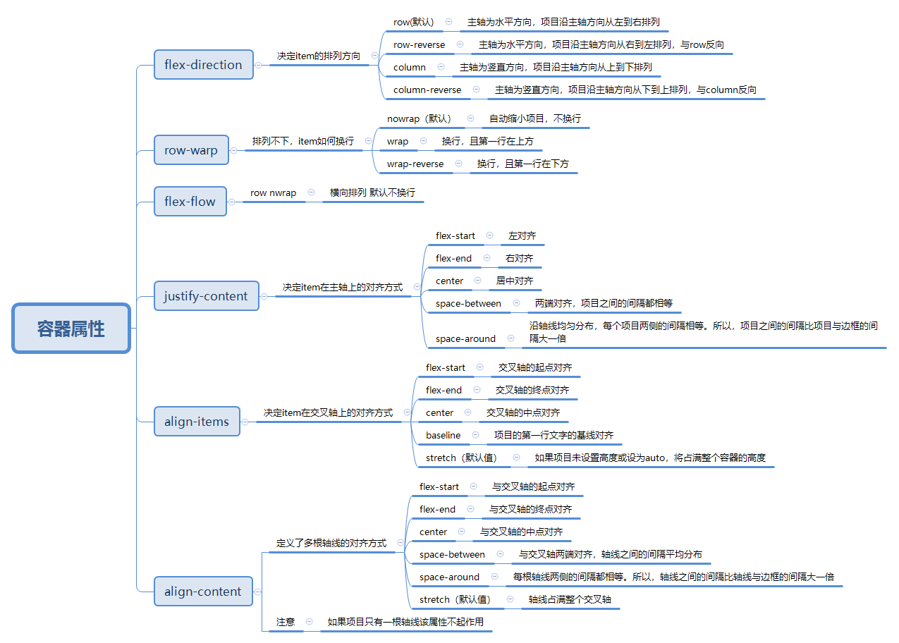
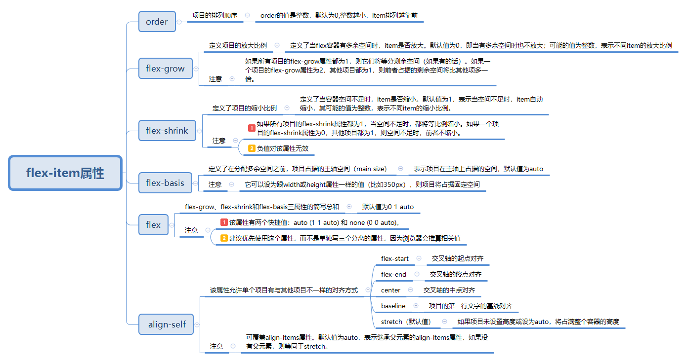

## css3开发常备核心技能
- 早期的双飞翼布局 + css HACK
- 基于移动端的PX与REM的转换兼容方案
- 弹性盒模型与Reset的选择
- 自制的ICON-FONT与常用字体排版
- CSS代码检测与团队项目规范
- CSS绘制特殊图形 高级技巧
- BFC IFC GFC FFC IE6里的BFC-hasLayout


### 双飞翼布局与圣杯布局*
- 双飞翼布局与圣杯模型：（早期给ie用的，）  
圣杯布局和双飞翼布局基本上是一致的，都是两边固定宽度，中间自适应的三栏布局，其中，中间栏放到文档流前面，保证先行渲染。解决方案大体相同，都是三栏全部float:left浮动，区别在于解决中间栏div的内容不被遮挡上；  

**圣杯布局**是中间栏在添加相对定位，并配合left和right属性，效果上表现为三栏是单独分开的（如果可以看到空隙的话）   
```
#HTML
<div class="bg">
    <div class="middle">middle</div>
    <div class="left">left</div>
    <div class="right">right</div>
</div>
#CSS
*{
    padding:0;
    margin:0;
}
.bg{
    padding:0 180px 0 200px;
}
.middle{
    width:100%;
    background:yellow
}
.left{
    width:200px;
    background:red;
    position:relative;
    margin-left:-100%;
    left:-200px
}
.right{
    width:180px;
    background:yellowgreen;
    position:relative;
    left:-180px;
    margin-left:-180px
}
.right,.left,.middle{
  float:left;
  height:100px
}
```
**双飞翼布局**是在中间栏的div中嵌套一个div，内容写在嵌套的div里，然后对嵌套的div设置margin-left和margin-right，效果上表现为左右两栏在中间栏的上面，中间栏还是100%宽度，只不过中间栏的内容通过margin的值显示在中间。
```
#HTML
<div class="bg">
    <div class="middle">
    <div class="inst">middle</div>
    </div>
    <div class="left">left</div>
    <div class="right">right</div>
</div>

#CSS
*{
    padding:0;
    margin:0
}
.right,.left,.middle{
  float:left;
  height:100px
}
.middle{
    width:100%;
    background:red;
}
.left{
    width:180px;
    background:yellow;
    margin-left:-180px
}
.right{
    width:200px;
    background:yellowgreen;
    margin-left:-200px
}
.inst{
    padding:0 200px 0 180px
}
```


### 基于移动端的PX与REM、移动端布局
- different size  different DPR
- 目前的设计稿 一般是 640 750 1125，一般要先均分成100份，(兼容vh,vm) 750/10 = 75px。div宽是240px*120px css的书写改为3.2rem * 1.6rem。 配合响应式修改html根的大小。
- 字体不建议使用rem的，data-dpr属性动态设置字体大小。屏幕变大放更多的文字，或者屏幕更大放更多的字。  
可以使用hotcss来进行移动端布局开发   
文档地址：http://imochen.github.io/hotcss/
- 淘宝的移动端布局方案 Flexible  一篇挺好的文章https://www.jianshu.com/p/04efb4a1d2f8


### CSS布局--多列布局等高  
1.利用 负margin 和 正padding 对冲实现(在父元素加overflow:hidden)


### 怪异盒模型与标准盒模型
两种模式可以利用**box-sizing**属性进行自行选择：--
   标准模式（W3C标准盒模型）：box-sizing:content-box;
   怪异模式（IE标准的盒子模型）：box-sizing:border-box;
> 两种模式的**区别**：
标准模式会被设置的padding撑开，而怪异模式则相当于将盒子的大小固定好，再将内容装入盒子。盒子的大小并不会被padding所撑开。
**标准模式**：盒子总宽度/高度 = 内容区宽度 /高度+padding+border + margin
**怪异盒模型**：盒子总宽度/高度 = 内容区宽度 /高度+ margin
> 如何解决样式的兼容性问题
建议不要给元素添加具有指定宽度的内边距，而是尝试将内边距或外边距添加到其父元素和子元素上。


### 水平垂直居中方式

```
//利用定位进行s水平垂直居中
//方法一
.parent{
position:relative;
}
.child{
    position:absolute;
    top:0;
    left:0;
    right:0;
    bottom:0;
    margin:auto;
}
//方法二
.parent{
    position:relative;
}
.child{
    width:100px;
    height:100px;
    position:absolute;
    top:50%;
    left:50%;
    margin-top:-50px;
    margin-left:50px;
}
//方法三
.child{
    position:absolute;
    top:50%;
    left:50%;
    transfrom:translate(-50%,-50%)
}
利用flex水平垂直居中
.parent{
    display:flex;
    just-content:center;
    align-item:center
利用table-cell
{
    display:table-cell;
    text-align:center;
    vertical-align:center
}
利用grid网格布局
.parent {
    display: grid;
}
.child {
    align-self: center;
    justify-self: center;
}

```

### css hack（IE6经典bug）
- 1.IE6怪异解析之padding与border算入宽高。  
**原因**：  
未加入文档声明造成非盒模型解析。  
**解决方式**  
加入文档声明<!doctype html>
- 2.IE6在块元素、左右浮动、设定margin时造成margin双倍（双边距）  
**解决方法**  
display：inline
- 3.以下三种其实是一种bug，其实也不算bug，举个例子：父标签高度20，子标签11，垂直居中，20-11=9，9是要分给文字的上边与下边，怎么分？IE6就会与其它的不同，所以，尽量避免。
1)字体大小为奇数之边框高度少1px  
**解决方法**  
字体设为偶数或line-height设为偶数。
2)line-height，文本垂直居中差1px  
**解决方法**  
line-height加一或减一  
3)与父标签的宽度的奇偶不同的居中造成1px的偏离。  
**解决方法**   
如果父标签是奇数宽度，则子标签页用奇数宽度，反之亦同 
- 4.内部盒模型超出父级时，父级被撑大  
**解决方法**  
父标签使用overflow：hidden
- 5.line-height默认行高bug  
**解决方法**   
给line-height设值
- 6.行标签之间会有一小段空白  
**解决方法**  
float或结构并排（可读性差，不建议）
- 7.标签高度无法小于19px  
**解决方法**  
overflow：hidden
- 8.左浮动元素margi-bottom失效  
**解决方法**  
显示设置高度or父标签设置padding-bottom代替子标签的margin-bottom
- 9. img于块元素中，底部多出空白。 
**解决方法**    
父级设置overflow：hidden或img{display：block}或margin：-5px
- 10.li之间会有间距  
**解决方法**  
float：left
- 11.块元素中有文字及右浮动的行内元素，行元素换行
**解决方法**
将行内元素置于块元素内的文字前
- 12.position下的left，bottom错位  
**解决方法**  
为父级（relative）设置宽高或添加*zoom：1  
- 13.子元素有设置position，则父级overflow失效。  
**解决方法**    
为父级设置{position：relative}

### 弹性盒模型
flex是CSS3的新属性，又叫弹性布局盒模型，是可以简洁，快速弹性布局的属性。  

<div align="center">

</div>
<div align="center">

</div>


**flex的兼容写法**
```
//flex浏览器兼容性
//IE10部分支持2012，需要-ms-前缀
//Android4.1/4.2-4.3部分支持2009 ，需要-webkit-前缀
//Safari7/7.1/8部分支持2012， 需要-webkit-前缀
//IOS Safari7.0-7.1/8.1-8.3部分支持2012，需要-webkit-前缀

.box{
 
    display: -webkit-flex;  /* 新版本语法: Chrome 21+ */
    display: flex;          /* 新版本语法: Opera 12.1, Firefox 22+ */
    display: -webkit-box;   /* 老版本语法: Safari, iOS, Android browser, older WebKit browsers. */
    display: -moz-box;      /* 老版本语法: Firefox (buggy) */
    display: -ms-flexbox;   /* 混合版本语法: IE 10 */   
 
 }
 
.flex1 {            
    -webkit-flex: 1;        /* Chrome */  
    -ms-flex: 1             /* IE 10 */  
    flex: 1;                /* NEW, Spec - Opera 12.1, Firefox 20+ */
    -webkit-box-flex: 1     /* OLD - iOS 6-, Safari 3.1-6 */  
    -moz-box-flex: 1;       /* OLD - Firefox 19- */       
}
```

### Reset的选择 
- 谨慎用*，*的杀伤力太大！！！
- Reset.css重置   
- Normalize.css修复  
- Neat.css融合（重置和修复的优点）解决浏览器统一问题,低级浏览器常见bug
- 必写的一些css代码

html{
    box-sizing:border-box
}
*:before,*:after{
    box-sizing:inherit;//继承  
}

### 自制的ICON-FONT与常用字体排版
- no-image时代 不超过纯色为2的图像
- 宋体非宋体 黑体非黑体 WIndows下的宋体叫中易宋体SimSun，Mac是华文宋体STSong。WIndows下的黑体叫中易黑体SimHei，Mac是华文黑体STHeiti。
- 不要只写中文字体名，保证西文字体在中文字体前面。Mac->Linux->Windows
- 切忌不要直接使用设计师PSD的设计font-family,关键时刻再去启动font-face（typo.css 、 Entry.css 、Type.css ）
- font-family: sans-serif;系统默认，字体多个单词组成加引号。

- css图标库http;//cssicon.space(用css绘制，比较快)
- 有关设计的相关
  |插件名|描述|
  |:--:|:--:|
  |underlinejs|动画文字下划线|
  |ResponsifyJS|使图像真正响应|


### CSS代码检测团队项目规范
- 1.不要使用多个class选择元素，如a.foo.boo，这在ie6及以下不能正确解析
- 2.移除空的css规则，如a{}
- 3.正确的使用显示属性，如display:inline不要和width，height，float，margin,padding同时使用，display:inline-block不要和float同时使用等
- 4.避免过多的浮动，当浮动次数超过十次时，会显示警告
- 5.避免使用过多的字号，当字号声明超过十种时，显示警告
- 6.避免使用过多web字体，当使用超过五次时，显示警告
- 7.避免使用id作为样式选择器
- 8.标题元素只定义一次
- 9.使用width:100%时要小心
- 10.属性值为0时不要写单位
- 11.各浏览器专属的css属性要有规范，
例如.foo{-moz-border-radius:5px;border-radius:5px}
- 12.避免使用看起来像正则表达式的css3选择器
- 13.遵守盒模型规则
**npm**:csshint - npm
**检测网址**：http://csslint.net/

### CSS绘制高级技巧
- 1.after && before 任何一个HTML元素都可以创造3个可以供我们操作的视觉元素，即三个矩形。
- 2.box-shadow是可以定义为任意颜色的，并且同一个元素可以投射出不同的box-shadow。
- 3.CSS3 渐变：线性渐变（Linear Gradients）- 向下/向上/向左/向右/对角方向  
            径向渐变（Radial Gradients）- 由它们的中心定义
- 4.border && border-radius 造就万千可能


### BFC/IFC/GFC/FFC

#### BFC-块级格式化上下文
- 规范解释：
   是Web页面的可视化CSS渲染的一部分，是布局过程中生成块级盒子的区域，也是浮动元素与其他元素的交互限定区域。
- BFC与BFC的形成条件；与BFC的作用？
（block-formatting-context）块级格式化上下文
俩个BFC之间的东西是相互独立的，不会重叠
形成BFC条件：
* 根元素
* 浮动元素：除none外；
* 绝对定位元素position：absolute/fixed
* display：inline-block/table-cells/table-captions
* overflow除了visible以外的值（hiddin，auto，scroll）

作用：
* 包含浮动元素
* 不被浮动元素覆盖
* 阻止外边距的折叠（外边距重叠后去最大的）。

事例：**子元素浮动后会造成父级元素出现高度塌陷。
通过给父元素设置overflow：hidden或float清除，等，
因为生成了bfc条件，触发了bfc的布局原则，能让浮动元素也会跟着计算，如何生成bfc条件，给父元素加overflowhidden。**

#### IFC-行内元素格式化上下文
IFC的line box（线框）高度由其包含行内元素中最高的实际高度计算而来（不受到竖直方向的padding/margin影响)
#### GFC-网格布局格式化上下文
当为一个元素设置display值为grid的时候，此元素将会获得一个独立的渲染区域，我们可以通过在网格容器（grid container）上定义网格定义行（grid definition rows）和网格定义列（grid definition columns）属性各在网格项目（grid item）上定义网格行（grid row）和网格列（grid columns）为每一个网格项目（grid item）定义位置和空间。 

#### FFC-自适应格式化上下文
display值为flex或者inline-flex的元素将会生成自适应容器（flex container），

### IE6里的BFC-hasLayout
Zoom属性是IE浏览器的专有属性；通过zoom：1；   可以触发hasLayout
所以可以解决ie下的浮动，margin重叠等一些问题；


clear：both正儿八经的清除浮动
```
.clearfix:after{
 content:'';
 dispaly:block;
 clear:both;
 height:0
}
.clearfix{
    zoom:1
}
```


