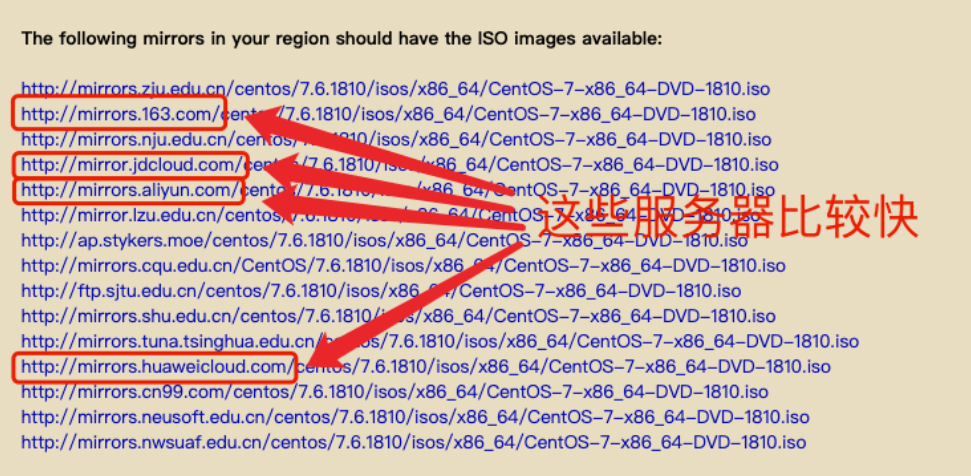
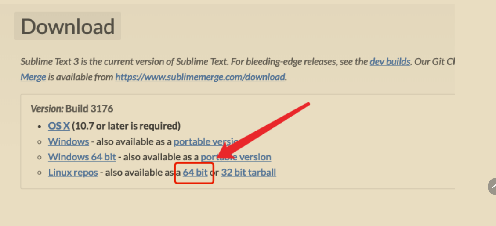
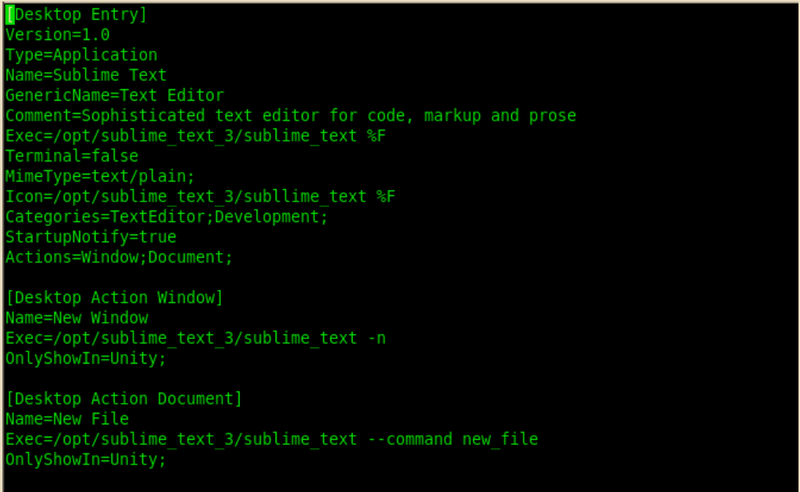

# Linux 开发环境初准备

## 认识Linux
----------
> **1.什么是Linux?**
- 官网：lernel.org
- 平时大家认为的Linux是一个操作系统，其实他的本质是操作系统的内核（其中包括各种各样的算法等，很底层），而centos，Ubuntu等是指Linux的发行版。
> **2.Linux与windows的区别？**

表面上的区别：
- windows上没有一些包，只有在linux下才能用
- 自动化发布基本在linux上；
- 服务器一般都是配置在linux上99.9%（形容词）剩下的可能就会在windows和uinux，一般是没有图形界面（装了图形界面对系统消耗，有时候连显示器都没有，一般都在黑窗口中，提升性能时软件与硬件都可提升，硬件一般都已经到了极限（涉及到量子力学），就是提升软件了）

内核区别
> **3.常用的发行版**

一共有六大发行版->其他的版本就是包了个壳。

------------

## Linux环境
> 安装Linux环境

准备工作
   - Windows下载安装 vmware workstation pro

     - 网址：https://www.vmware.com/cn.html

     - 首先要 vmware.com 注册⼀一个⽤用户（或者直接找个注册码）
     - 到下载⻚页⾯面下载 VMware Workstation Pro 15.0.2 for Windows
     - 下载⻚页⾯面链接https://my.vmware.com/cn/web/vmware/info/slug/desktop_end_user_com
puting/vmware_workstation_pro/15_0
     - 把 vmware workstation pro 安装到你的windows电脑上
     - 注意：不要升级（会多出来一些东西，注册码也失效）
  - Mac下载安装虚拟机软件
     - vmware Fusion
     - virtualBox（不推荐，不好用）
     - parallelels Desktop(推荐)
  - 下载 CentOS 安装盘镜像
     - CentOS官⽹网： https://www.centos.org/
     - 光盘镜像下载⻚页⾯面：https://www.centos.org/download/
     - 点击“DVD ISO”按钮，这个是带有图形界⾯面的版本。Minimal ISO 不不带图形界⾯面，最好也下
载，我们以后的课程中会⽤用到。
     - 点击按钮后会进⼊入⼀一个镜像⽹网站的列列表，选择阿⾥里里云、华为云、163等⽐比较快的服务器器

     

  - 开启计算机硬件的虚拟化⽀支持选项
    - 先打开任务管理理器器，切换到“” 标签⻚页，检查“虚拟化”是否为已启⽤用状态 
  - 如果状态为“未启⽤用”，按照如下步骤操作

    1、重启电脑，在主板显示画⾯面，快速寻找进⼊入BIOS的按键。根据品牌不不同，可能是F2、Del
或其他键。 2、进⼊入BIOS后，寻找进⼊入“System Configuration”。 3、找到“Virtualization
Technology”，按回⻋车键。 4、选择“Enabled”，按Enter回⻋车键。 5、然后保存重启即可。
---------
## 安装过程
> 步骤：
- 1.硬件兼容性（用最新的）;
- 2.安装的LinuxISO文件从Linux版本文件来的;
- 3.设置虚拟机的名称（就是你显示的名称）、以及虚拟机存放的位置（不要放到C盘，如果放到了C盘空余出10G的空间，因为会产生好多文件）;
- 4.配置处理器的数量一般给1-2个就好，主要看自己电脑的配置，给4个顶天了。并不是越多越好
- 5.虚拟机的内存->DVD版推荐2G   min版推荐1G
- 6.网络适配器：用桥接模式（用物理机的地址）（不要用NAT模式）-----如何查看（查看---网络管理）
- 7.最大的磁盘大小：默认20G就行了，是否拆分磁盘看实际需要
- 8.设置虚拟机产生的文件目录（需要创建一个单独的目录）
- 9.提示是否要安装（第一行是直接安装，第二行是测试后安装）
- 10.三个需要更改的地方
     - 关掉kdump（除非你在你的Linux上做c语言的开发）
     - 设置Root账户（根用户可以删库跑路）密码设置的复杂一些，如果设置简单的密码，双击完成退出界面
     - 创建普通用户 （使用用户名登录，不是全名）
- 11.网络与主机名：打开试一下是否能够获取IP地址
- 12.安全策略不要动
- 13.安装位置点完成，选择默认安装
- .删除虚拟机，在管理中有从磁盘中移除（前提先关闭虚拟机）
## 配置过程
- 登录（连接远程服务器）
   - 在无图形界面的情况下，查看IP地址---if config（很老了已经被去掉）---用IP addr
   - 登录：ssh 用户名@IP地址 提示输入密码
   - scp文件传输命令---上传文件：scp 源文件路径 去处文件路径（root/@127.0.0.1:/）
- 退出  exit
- 密码忘了进入sigon模式更改
---------
##认识Linux环境
Linux目录下的文件都是用来做什么的

Linux下没有盘符是文件树结构，windows只有有限的文件数结构；
|目录|应放置的文档内容|
|:--|:-:|
|<div style="color:red">/bin</div>|系统有很多放置执⾏文档的目录，但/bin⽐比较特殊。因为/bin放置的是在单⼈人维护模式下还能够被操作的指令。在/bin底下的指令可以被root与⼀一般帐号所使⽤用，主要有：cat,chmod(修改权限), chown, date, mv, mkdir, cp, bash等等常⽤用的指令。（一般放系统命令，就是一些不能内置到shell中的命令如cd，原因之一有文件太大）|
|<div style="color:red">/boot</div>|主要放置开机会使⽤用到的档案，包括Linux核⼼心档案以及开机选单与开机所需设定档等等。Linux kernel常⽤用的档名为：vmlinuz ，如果使⽤用的是grub这个开机管理理程式，则还会存在/boot/grub/这个目录。<div style="color:red">放的是核心文件，不要动</div>|
|/dev|在Linux系统上，任何装置与周边设备都是以档案的型态存在于这个目录当中。只要通过存取这个目录下的某个档案，就等于存取某个装置。比要重要的档案有/dev/zero, /dev/tty , /dev/lp, / dev/hd, /dev/sd*等等|
|/etc|系统主要的设定档⼏几乎都放置在这个⽬目录内，例例如⼈人员的帐号密码档、各种服务的启始档等等。 ⼀一般来说，这个⽬目录下的各档案属性是可以让⼀一般使⽤用者查阅的，但是只有root有权⼒力力修改。 FHS建议不不要放置可执⾏行行档(binary)在这个⽬目录中。 ⽐比较重要的档案有：/etc/inittab, /etc/init.d/, /etc/modprobe.conf, /etc/X11/, /etc/fstab,/etc/sysconfig/等等。 另外，其下重要的⽬目录有：/etc/init.d/ ：所有服务的预设启动script都是放在这⾥里里的，例例如要启动或者关闭iptables的话： /etc/init.d/iptablesstart、/etc/init.d/ iptables stop/etc/xinetd.d/ ：这就是所谓的super daemon管理理的各项服务的设定档⽬目录。/etc/X11/ ：与X Window有关的各种设定档都在这⾥里里，尤其是xorg.conf或XF86Config这两个X Server的设定档。<div style="color:red">用来放配置文件、脚本用的</div> |
|/home|这是系统预设的使⽤用者家⽬目录(home directory)。 在你新增⼀一个⼀一般使⽤用者帐号时，预设的使⽤用者家⽬目录都会规范到这⾥里里来。⽐比较重要的是，家⽬目录有两种代号： ~ ：代表当前使⽤用者的家⽬目录，⽽而 ~guest：则代表⽤用户名为guest的家⽬目录。<div style="color:red">普通用户</div>|
|/root|系统管理理员(root)的家⽬目录。 之所以放在这⾥里里，是因为如果进⼊入单⼈人维护模式⽽而仅挂载根⽬目录时，该⽬目录就能够拥有root的家⽬目录，所以我们会希望root的家⽬目录与根⽬目录放置在同⼀一个分区中。|
|/lib|系统的函式库⾮非常的多，⽽而/lib放置的则是在开机时会⽤用到的函式库，以及在/bin或/sbin底下的指令会呼叫的函式库⽽而已 。 什什么是函式库呢？妳可以将他想成是外挂，某些指令必须要有这些外挂才能够顺利利完成程式的执⾏行行之意。 尤其重要的是/lib/modules/这个⽬目录，因为该⽬目录会放置核⼼心相关的模组(驱动程式)。|
|/media|media是媒体的英⽂文，顾名思义，这个/media底下放置的就是可移除的装置。 包括软碟、光碟、DVD等等装置都暂时挂载于此。 常⻅见的档名有：/media/floppy,/media/cdrom等等|
|/mnt|如果妳想要暂时挂载某些额外的装置，⼀般建议妳可以放置到这个目录中。在古早时候，这个目录的用途与/media相同啦。 只是有了了/media之后，这个目录就⽤用来暂时挂载⽤用了了。|
|/opt|这个是给第三方协⼒软体放置的⽬目录 。 什么是第三⽅协⼒软体啊？举例来说，KDE这个桌⾯面管理理系统是⼀一个独⽴立的计画，不不过他可以安装到Linux系统中，因此KDE的软体就建议放置到此目录下了了。 另外，如果妳想要自行安装额外的软体(⾮原本的distribution提供的)，那么也能够将你的软体安装到这⾥里里来。 不不过，以前的Linux系统中，我们还是习惯放置在/usr/local目录下|
|/sbin|Linux有⾮非常多指令是用来设定系统环境的，这些指令只有root才能够利用来设定系统，其他使⽤用者最多只能⽤用来查询⽽而已。放在/sbin底下的为开机过程中所需要的，里面包括了了开机、修复、还原系统所需要的指令。至于某些伺服器软体程式，⼀一般则放置到/usr/sbin/当中。⾄至于本机⾃行安装的软体所产生的系统执行档(system binary)，则放置到/usr/local/sbin/当中了了。常⻅见的指令包括：fdisk, fsck, ifconfig, init, mkfs等等。|
|/srv|srv可以视为service的缩写，是⼀些网路服务启动之后，这些服务所需要取用的资料目录。 常⻅见的服务例如WWW, FTP等等。 举例来说，WWW伺服器需要的网页资料就可以放置在/srv/www/⾥面。呵呵，看来平时我们编写的代码应该放到这⾥了了。|
|/tmp|这是让⼀一般使用者或者是正在执⾏的程序暂时放置档案的地方。这个目录是任何人都能够存取的，所以你需要定期的清理⼀下。当然，重要资料不可放置在此目录啊。 因为FHS甚⾄至建议在开机时，应该要将/tmp下的资料料都删除。|

## 前端开发必须要懂得知识
> 网络端口
- 概念：一个端口在同一时间只能被一个进程使用
- 一些服务器默认的端口
    - apache - 80
    - http端口 - 80
    - http代理端口 - 8080
    - https - 443
    - nginx - 80
- 端口冲突是怎么回事？
一个端口在同一时间被多个进程使用，发生报错；  
**解决方案**：停掉端口或，修改端口

>什么是服务

服务一直在跑不占用界面
- 常见得服务器
  - apache、tomcat、nginx服务器
- 关于管理服务的一些命令
```
//查看服务状态

systemctl status nginx(服务器名)
如果服务正在跑着状态是active否则是inactine(dead)


//停止服务

systemctl stop nginx(服务器名)
//开启服务

systemctl start nginx(服务器名)
//重启服务

systemctl restart nginx(服务器名)

nginx停止  首先查询nginx主进程号  ps -ef|grep nginx 

正常停止   sudo kill -QUIT 主进程号

快速停止   sudo kill -TERM 主进程号

sudo ./nginx 启动
sudo ./nginx 启动
重启 sudo ./nginx -s reload 

```
- 守护进程pm2、setsid(调用的是Linux的守护进程)

可以实现多任务
进行操作进程
-----------------------------
## 安装Linux的开发环境
> 1.安装Node.js
```
yum安装⽅方法 https://rpm.nodesource.com/

# 添加官⽅方的yum源
curl -sL https://rpm.nodesource.com/setup_11.x | bash -
# yum命令安装
yum install -y nodejs
# 查看安装的版本
node -v

源码编译安装⽅方法（后⾯面的课程会讲）
```
> 2.安装Sublime Text3
- 下载 https://www.sublimetext.com/3

```
# 解压缩
tar -xvvf sublime_text_3_build_3176_x64.tar.bz
# 移动到 /opt 路路径下
mv sublime_text_3 /opt/
# 复制快速启动⽂文件到系统菜单⽬目录
cp /opt/sublime_text_3/sublime_text.desktop /usr/share/applications
# 按照下图修改快速启动⽂文件中的配置
vim /usr/share/applications/sublime_text.desktop
# 通过菜单 applications->programming->Sublime Text 打开软件
```

>3.安装 XAMPP 集成开发环境
- 下载地址：https://www.apachefriends.org/
- 中⽂文站：http://www.xampps.com/ （版本有点⽼老老）
## 注意
> 安装linux终端  

windows终端：
- xshell
- putty(太老不好用)
- cmder（内置git，ssh命令）
- xshell
- 深度系统

Mac终端：
- 自带的终端
- iterm2
- oh-my-zsh 
> Mac电脑介绍

- 内核：uinux下得BSD内核
- 命令集与Linux还是有差异的

> linux版权

属于贝尔实验室

> 找不到盘符切换到根cd /
> 如何连接U盘

先挂载到Linux上，用mount命令，一般用来做维护

