# HTTP的那些事
- 当我们输入网址后发生了什么
- HTTP协议详解
- HTTPS协议分析
- HTTP2协议分析
- 了解HTTP3
- 后台服务与HTTP
- 反向代理与WEB服务

## 当我们输入网址后发生了什么

开局我们讨论一下一直以来很火热的面试题当我们输入网址后发生了一些什么事？

来上图：
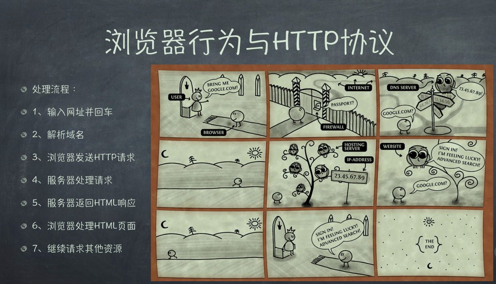

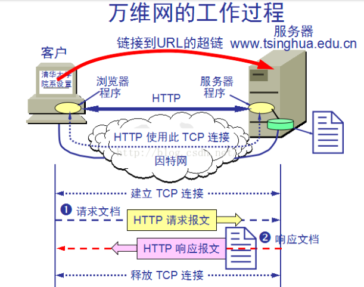

接下来我们解析以下这些图，分析以下当我们输入网址后发生了一些什么事？

**1.首先我们输入URL地址并且按下回车键。**

**2.穿透防火墙进入互联网，即从局域网访问到互联网，所以防火墙可以看成内网和外网的边界，防火墙一般分为软件与硬件（软件：firwall/Iptables等，这些软件通常是一些策略，用来调用Linux的子系统的；硬件：一般是抽象概念，而且贵，路由器其实也是，通过猫向电信拨号）**

**3.负责域名查询与解析的DNS服务：**

1） 用户通常使用主机名或域名来访问某网站，而不是直接通过IP来访问，因为字母数字配合的表示形式更符合人类的记忆习惯，可计算机却不理解这些名称，因此DNS服务应运而生，DNS协议提供通过域名查找IP地址，或逆向从IP地址反查域名的服务。
DNS查询过程如下：

2） 操作系统会先检查本地的hosts文件是否有这个网址映射关系，如果有，就先调用这个IP地址映射，完成域名解析。
如果hosts里没有这个域名的映射，则查找本地DNS解析器缓存，是否有这个网址映射关系，如果有，直接返回，完成域名解析。
如果hosts与本地DNS解析器缓存都没有相应的网址映射关系，首先会找TCP/IP参数中设置的首选DNS服务器，在此我们叫它本地DNS服务器，此服务器收到查询时，如果要查询的域名，包含在本地配置区域资源中，则返回解析结果给客户机，完成域名解析，此解析具有权威性。

3） 如果要查询的域名，不由本地DNS服务器区域解析，但该服务器已缓存了此网址映射关系，则调用这个IP地址映射，完成域名解析，此解析不具有权威性。

4） 如果本地DNS服务器本地区域文件与缓存解析都失效，则根据本地DNS服务器的设置（是否设置转发器）进行查询，如果未用转发模式，本地DNS就把请求发至13台根DNS，根DNS服务器收到请求后会判断这个域名(.com)是谁来授权管理，并会返回一个负责该顶级域名服务器的一个IP。本地DNS服务器收到IP信息后，将会联系负责.com域的这台服务器。这台负责.com域的服务器收到请求后，如果自己无法解析，它就会找一个管理.com域的下一级DNS服务器地址(baidu.com)给本地DNS服务器。当本地DNS服务器收到这个地址后，就会找baidu.com域服务器，重复上面的动作，进行查询，直至找到www.baidu.com主机。

5） 如果用的是转发模式，此DNS服务器就会把请求转发至上一级DNS服务器，由上一级服务器进行解析，上一级服务器如果不能解析，或找根DNS或把转请求转至上上级，以此循环。不管是本地DNS服务器用是是转发，还是根提示，最后都是把结果返回给本地DNS服务器，由此DNS服务器再返回给客户机。

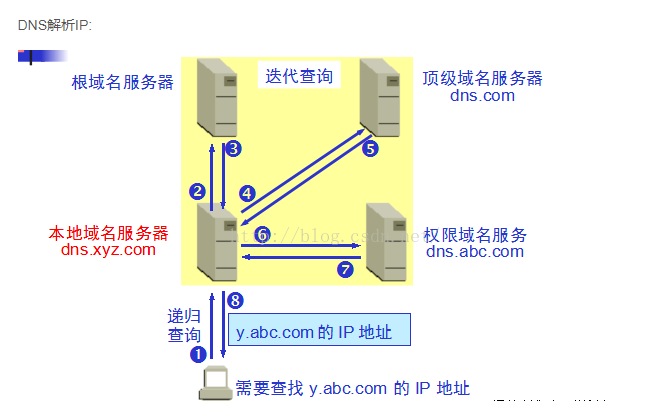
**注意：**

- 从客户端到本地DNS服务器是属于递归查询，而DNS服务器之间就是的交互查询就是迭代查询。
- 可以通过`trace - www.baidu.com`去探查到底走了多少步,探查了多少台DNS服务器 ;
- 提供转换DNS的就是DNS服务器
- **DNS劫持**：DNS劫持又称域名劫持，是指在劫持的网络范围内拦截域名解析的请求，分析请求的域名，把审查范围以外的请求放行，否则返回假的IP地址或者什么都不做使请求失去响应，其效果就是对特定的网络不能反应或访问的是假网址。


**4.浏览器发送HTTP请求**

> 应用层 客户端发送HTTP请求报文
HTTP报文包括：

- 报文首部 （请求行+各种首部字段+其他）
- 空行
- 报文主体 （应被发送的数据）通常并不一定要有报文主体

下面对百度首页请求报文首部进行分析：

请求行  
```
请求方法GET 请求URI /   HTTP协议版本 1.1
GET / HTTP/1.1 
```

首部字段
```
请求资源所在服务器
Host: www.baidu.com
连接方式：持久连接     HTTP/1.1之前版本默认非持久连接
Connection: keep-alive
报文指令：要求所有中间服务器不返回缓存资源
Pragma: no-cache
控制缓存的行为：缓存前必须先确认其有效性，防止从缓存中返回过期的资源
Cache-Control: no-cache
用户代理可处理的媒体类型
Accept: text/html,application/xhtml+xml,application/xml;q=0.9,image/webp,*/*;q=0.8   q表示权重从而区分优先级
http客户端浏览器信息
User-Agent: Mozilla/5.0 (Windows NT 6.1) AppleWebKit/537.36 (KHTML, like Gecko) Chrome/49.0.2623.87 Safari/537.36
可接受的内容编码类型
Accept-Encoding: gzip, deflate, sdch
可接受的语言
Accept-Language: zh-CN,zh;q=0.8
相关信息或标记
Cookie: BAIDUID=3C67AA3EF6B3347D3AA986CE489268C4:FG=1; BIDUPSID=3C67AA3EF6B3347D3AA986CE489268C4;
```
> 传输层 确保传输报文可靠性的TCP协议

位于传输层的TCP协议为传输报文提供可靠的字节流服务。为了方便传输，将大块的数据分割成以报文段为单位的数据包进行管理，并为它们编号，方便服务器接收时能准确地还原报文信息。TCP协议通过“三次握手”等方法保证传输的安全可靠。

“三次握手”的过程是，发送端先发送一个带有SYN（synchronize）标志的数据包给接收端，在一定的延迟时间内等待接收的回复。接收端收到数据包后，传回一个带有SYN/ACK标志的数据包以示传达确认信息。接收方收到后再发送一个带有ACK标志的数据包给接收端以示握手成功。在这个过程中，如果发送端在规定延迟时间内没有收到回复则默认接收方没有收到请求，而再次发送，直到收到回复为止。

这个好理解一些
- 发送方:SYN(synchronize)
- 接收方:SYN/ACK(acknowledgement),确认信息传达
- 发送方:ACK - 确认接收方在线可收消息，握手结束
- Accept

详细过程如下图

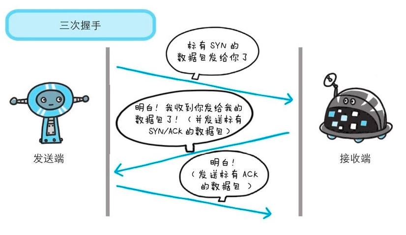

TCP三次握手的的好处在于：发送方可以确认接收方仍然在线，不会因为白发送而浪费资源。

> 网络层 负责传输的IP协议

IP协议的作用是把TCP分割好的各种数据包传送给接收方（路由选择协议：主要做的是通过查找路由表确定如何到达服务器，期间可能经过多个路由器，这些都是由路由器来完成的工作，通过查找路由表决定通过那个路径到达服务器）。

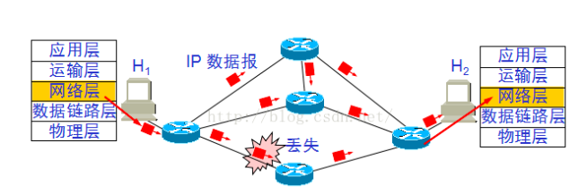

> 链路层 传输数据的硬件部分

客户端的链路层，包通过链路层发送到路由器，而在实际网络的链路上传送数据帧时，最终还是必须使用硬件地址。每一个主机都设有一个 ARP 高速缓存(ARP cache)，里面有所在的局域网上的各主机和路由器的 IP 地址到硬件地址的映射表。当主机 A 欲向本局域网上的某个主机 B 发送 IP 数据报时，就先在其 ARP 高速缓存中查看有无主机 B 的 IP 地址。如有，就可查出其对应的硬件地址，再将此硬件地址写入 MAC 帧，然后通过局域网将该 MAC 帧发往此硬件地址。至此请求报文已发出，客户端发送请求的阶段结束。

具体过程如下图：

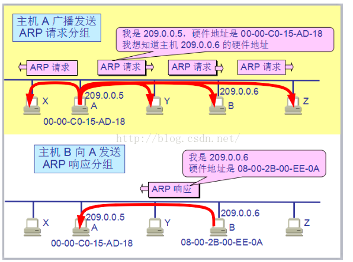

> 服务器接收报文

接收端服务器在链路层接收到数据后，删除该层的首部信息并向网络层传递，网络层将接收的数据向传输层传递，在传输层会将传输的数据按序号从组请求报文并传送给应用层。当数据传输到应用层才能算真正接收到由客户端发送过来的HTTP请求

> 应用层 服务器发送HTTP响应报文

下面对百度首页响应报文首部进行分析：

**状态行**
```
协议版本 状态码 状态码原因短语
HTTP/1.1 200 OK
```

**首部字段**

```
当前服务器上安装的HTTP服务器程序信息
bfe:Baidu Front End。百度人自己写的反向代理及防攻击接入层
Server: bfe/1.0.8.18
响应日期时间
Date: Thu, 08 Dec 2016 14:48:19 GMT
说明报文实体的媒体类型
Content-Type: text/html; charset=utf-8
http://tool.oschina.net/commons/（常用对照表）
传输编码方式：分块编码
Transfer-Encoding: chunked
链接方式：持久链接  http/1.1之后这个已经没必要了
Connection: keep-alive
只接受对持相同自然语言的请求返回缓存
Vary: Accept-Encoding
缓存控制：仅向特定用户返回响应
Cache-Control: private
Cxy_all: baidu+43a6e396a3ed26dc7d1de13c6af79e49
缓存过期时间
Expires: Thu, 08 Dec 2016 14:47:38 GMT
X-Powered-By: HPHP
X-UA-Compatible: IE=Edge,chrome=1
Strict-Transport-Security: max-age=172800
BDPAGETYPE: 1
BDQID: 0xc9d964a600018bb8
BDUSERID: 0
设置cookie
Set-Cookie: H_PS_PSSID=1451_21116_17001_21408_21417_21554_20929; path=/;
```

响应报文的传输方式与请求报文相同，简单点说就是原路返回

> 客户端收到页面，浏览器渲染页面

执行以下过程： 
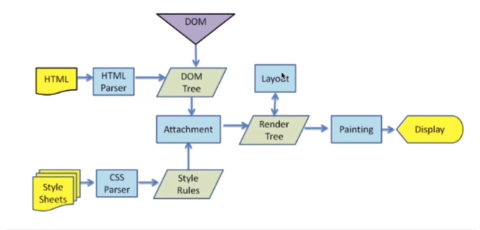

> 1.解析HTML

解析一个文档即将其转换为具有一定意义的结构(编码可以理解和使用的东西)。解析的结果通常是表达文档结构的节点树，称为解析树或语法树。

解析是以文档所遵循的语法规则（编写文档所用的语言或格式）为基础的。所有可以解析的格式都必须对应确定的语法（由词汇和语法规则构成）。这称为与上下文无关的语法。
解析的过程可以分成两个子过程：词法分析和语法分析。

- 词法分析是将输入内容分割成大量标记的过程。标记是语言中的词汇，即构成内容的单位。在人类语言中，它相当于语言字典中的单词。
- 语法分析是应用语言的语法规则的过程。
解析器通常将解析工作分给以下两个组件来处理：

- 词法分析器（有时也称为标记生成器），负责将输入内容分解成一个个有效标记；
- 而解析器负责根据语言的语法规则分析文档的结构，从而构建解析树。

由于不能使用常规的解析技术，浏览器就创建了自定义的解析器来解析 HTML。此解析算法由两个阶段组成：标记化和树构建。
具体的解析过程可参考浏览器的工作原理中的标记化算法和构建树算法

解析器的输出“解析树”是由 DOM 元素和属性节点构成的树结构。DOM 是文档对象模型 (Document Object Model) 的缩写。它是 HTML 文档的对象表示，同时也是外部内容（例如 JavaScript）与 HTML 元素之间的接口。解析树的根节点是“Document”对象。

当解析到link标签时会请求相应的CSS文件，并将其CSS规则解析为StyleSheet对象，CSS文件中的其他外链资源如背景图片等只有等到其规则与DOM树某节点相匹配时才会加载
当解析遇到img标签时会根据路径向服务器相应的资源文件夹中请求图片资源，但并不会等待图片资源下载完再去解析接下来的html，而是并发执行即图片资源仍在下载，html解析也在进行。如果没有定义图片的height和width属性，那么浏览器为了能够显示每一个加载的图像，它需要先下载图像，然后解析出图像的高度和宽度，并在显示窗口留出相应的屏幕空间，这样就会导致浏览器不断地重新计算/调整页面的布局，这可能会延迟文档的显示，并导致页面重绘。

当解析遇到script标签时，将启动 JavaScript 引擎，这时将阻塞 DOM 树的构建。因为 JavaScript 执行过程中， JavaScript 很可能会对 DOM 树进行读写操作。直到 JavaScript 执行完毕（此时执行的是全局对象初始创建和全局上下文中代码的执行），DOM树才会恢复构建。

在聊浏览器渲染之前，我们先明确一个概念： 事实上，我们看到的页面并不是直观所见的一层图页，而是由许多DOM元素渲染层(Layers)组成的，如下图。


> 2.页面的渲染过程

所以一个的页面的渲染过程由如下几步构成：

- 构建渲染树(Render Tree): 根据DOM和CSSOM树渲染，不可见元素不被会渲染

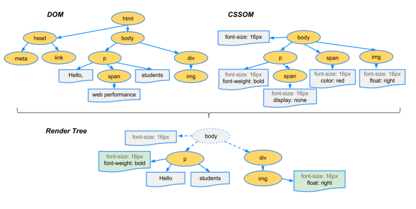

为了更好地用户体验效果，浏览器会在构建DOM树的同时，也在构建render树。呈现树的每一个节点即为与其相对应的DOM节点的CSS框，框的类型与DOM节点的display属性有关，block元素生成block框，inline元素生成inline框。每一个呈现树节点都有与之相对应的DOM节点，但DOM节点不一定有与之相对应的呈现树节点，比如display属性为none的DOM节点，而且呈现树节点在呈现树中的位置与他们在DOM树中的位置不一定相同，比如float与绝对定位元素。在构建render树的时候需要为DOM树匹配CSS规则，在这个阶段因为匹配规则是从右往左匹配的，所以css的编写规则很重要。不好的CSS选择器写法会影响到页面渲染的效率，具体是如何编写高效的CSS规则的可参考这篇文章CSS[选择器性能分析](https://www.cnblogs.com/jesse131/p/6135773.html)

> 布局render树

CPU根据渲染树布局计算元素的具体位置和大小，转换成绝对像素，并且根据样式，分割成多个独立的渲染层(Layers)，将每一层对应到位图中

布局通常具有以下模式：

1.父呈现器确定自己的宽度。

2.父呈现器依次处理子呈现器，并且：
1. 放置子呈现器（设置 x,y 坐标）。
2. 如果有必要，调用子呈现器的布局，这会计算子呈现器的高度。

3.父呈现器根据子呈现器的累加高度以及边距和补白的高度来设置自身高度，此值也可供父呈现器的父呈现器使用。

4.将其 dirty 位设置为 false

> 绘制render树

 GPU根据每个渲染层(Layers)的位图绘制每个点，即像素填充,并且将所有渲染层缓存，如果下次页面变动但是渲染层没变就不会触发重绘。

 > 层级合成(Compositing):
 
 顾名思义，即处理多层渲染层之间的关系，将其合成为一个完整的页面

 > 重绘和重排

 `重绘（repaint）:`

- 元素视觉表现属性被改变即触发重绘，如改变visibility，color等，不会影响到dom结构

`reflow（重排）:`

- 与repaint区别就是：所有影响dom的元素布局的事件都会触发重排。同时也会触发repaint。

- 这种开销是非常昂贵的，导致性能下降是必然的，页面元素越多效果越明显。

`reflow常见情况：`

- 增删改DOM节点
- 移动DOM的位置或是动画显示(所以尽量用canvas来做动画)
- 修改width、display等CSS样式
- resize窗口或是滚动的时候
- 修改网页默认字体(不建议)
- display:none会触发reflow和repaint，而visibility:hidden只会产生repaint


## HTTP协议详解
- `HTTP`是超文本传输协议，从www浏览器传输到本地浏览器的一种传输协议，网站是基于HTTP协议的，例如网站的图片、CSS、JS等都是基于HTTP协议进行传输的,图片、视频、音频都是二进制数据。

- HTTP协议是由从客户机到服务器的请求(Request)和从服务器到客户机的响应(response)进行约束和规范。

### HTTP协议的历史进程

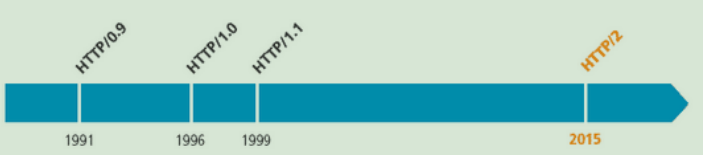

### 了解TCP/IP协议栈

- 1.应用层

    - 为用户提供所需要的各种服务，例如：HTTP、FTP、DNS、SMTP等.直接与应用程序打交道

- 2. 传输层

    - 为应用层实体提供端到端的通信功能，保证数据包的顺序传送及数据的完整性。该层定义了两个主要的协议：传输控制协议（TCP）和用户数据报协议（UDP).
- 3. 网络层
    - 主要解决主机到主机的通信问题。IP协议是网际互联层最重要的协议。
- 4. 网络接口层
    - 负责监视数据在主机和网络之间的交换（）

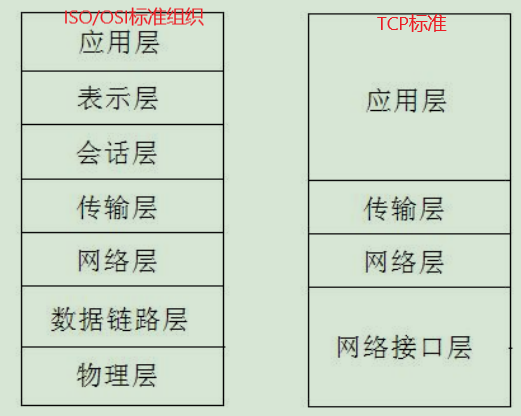

### 在TCP/IP协议栈中的位置

HTTP协议在TCP/IP协议栈的应用层，他依赖TCP，属于应用层协议

- 目前普遍应用版本HTTP 1.1
- 正在逐步向HTTP 2迁移
- HTTP默认端口号为80
- HTTPS默认端口号为443
- TCL、SSL用来加密是一个方案，是一种模块。

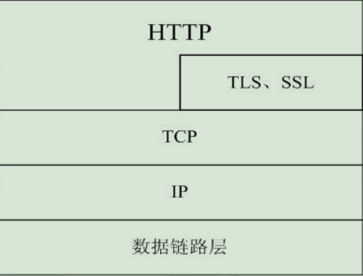

### HTTP的工作过程

> 事物？

**特点**：这个操作分为若干步，可以是一步，也可以是多步，步骤一定要按顺序完成，任何一个步骤出错，任务就会失败，那么他就是事物了。

在JAVA的框架有事物操作，任何塞到框架的东西，都会让其有事物操作

> 一次HTTP操作称为一个事务，其工作过程可分为四步,这个严格的格式是协议规定的：

- 1)首先客户机与服务器需要建立连接。只要单击某个超级链接，HTTP的工作开始。
- 2)建立连接后，客户机发送一个请求给服务器，请求方式的格式为：统一资源标识符(URL)、协议版本号，
后边是MIME信息包括请求修饰符、客户机信息和可能的内容。
- 3)服务器接到请求后，给予相应的响应信息，其格式为一个状态行，包括信息的协议版本号、一个成功
或错误的代码，后边是MIME信息包括服务器信息、实体信息和可能的内容。
- 4)客户端接收服务器所返回的信息通过浏览器显示在用户的显示屏上，然后客户机与服务器断开连接。如果在以上过程中的某一步出现错误，那么产生错误的信息将返回到客户端，有显示屏输出。对于用户来说，这些过程是由HTTP自己完成的，用户只要用鼠标点击，等待信息显示就可以了。

### 请求与响应

- HTTP请求组成：请求行、消息报头、请求正文。
- HTTP响应组成：状态行、消息报头、响应正文。
- 请求行组成：以一个方法符号开头，后面跟着请求的URI和协议的版本。
- 状态行组成：服务器HTTP协议的版本，服务器发回的响应状态代码和状态代码的文本描述。

#### 请求报文

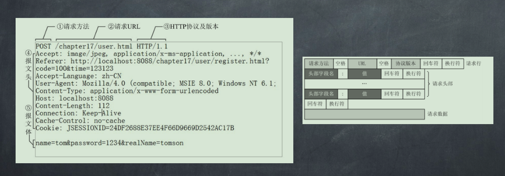

#### 响应报文

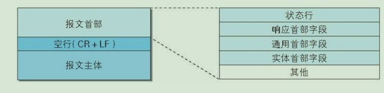
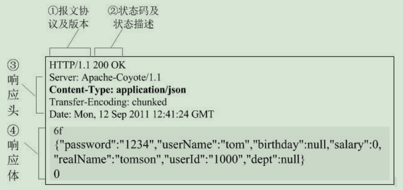

#### 请求方法


- `OPTIONS`: 返回服务器针对特定资源所支持的HTTP请求方法。也可以利用向Web服务器发送'*'的请求来测试服务器的功能性。或者请求查询服务器的性能，或者查询与资源相关的选项和需求
- `HEAD`: 向服务器索要与GET请求相一致的响应，只不过响应体将不会被返回。这一方法可以在不必传输整个响应内容的情况下，就可以获取包含在响应消息头中的元信息。

- `GET`：向特定的资源发出请求。注意：GET方法不应当被用于产生“副作用”的操作中，例如在web app.中。其中一个原因是GET可能会被网络蜘蛛等随意访问。

- `POST` ：向指定资源提交数据进行处理请求(例如提交表单或者上传文件)。数据被包含在请求体中。POST请求可能会导致新的资源的建立和/或已有资源的修改。

- `PUT` ：向指定资源位置上传其最新内容,请求服务器存储一个资源，并用Request-URI作为其标识。

- `DELETE`： 请求服务器删除Request-URI所标识的资源。

- `TRACE` ：请求服务器回送收到的请求信息，主要用于测试或诊断。

- `CONNECT`： HTTP/1.1协议中预留给能够将连接改为管道方式的代理服务器。

#### HTTP状态码

状态代码有三位数字组成，第一个数字定义了响应的类别，且有五种可能取值：
- 1xx：指示信息--表示请求已接收，继续处理
- 2xx：成功--表示请求已被成功接收、理解、接受
- 3xx：重定向--要完成请求必须进行更进一步的操作
- 4xx：客户端错误--请求有语法错误或请求无法实现
- 5xx：服务器端错误--服务器未能实现合法的请求

> HTTP状态码列表

| 状态码 | 状态码英文名称 | 中文描述 |  
| :----: | :-----  | :-----|
| 100 | Continue | 继续，客户端应该继续其请求 |
| 101 | Switching Protocols | 切换协议，服务器根据客户端的请求切换协议。只能切换到高的协议，例如：切换到http的新版本协议 |
| 200 | OK | 请求成功，一般用于GET和POST请求 |
| 201 | Created | 已创建，成功请求并创建了新资源 |
| 202 | Accepted | 已接受。已经接受请求，但未处理完成 |
| 203 | Non-Authoritative Information |非授权信息。请求成功。但返回的meta信息不在原始的服务器，而是一个副本|
| 204 | No Centent | 无内容。服务器处理成功，但未返回内容。在未更新网页的情况下，可确保浏览器继续显示当前文档 |
| 205 | Reset Content | 重置内容。服务器处理成功，用户终端（例如：浏览器）应重置文档视图 可通过此返回码清楚浏览器的表单域|
| 206 | Partial Content | 服务器成功请求了部分GET请求 |
| 300 | Multiple Choices| 多种选择。请求资源可包括多个位置，相应可返回一个资源特征与地址的列表用于用户终端（例如浏览器的选择）|
| 301 | Moved Permanently | 永久移动。请求的资源已被永久的移动到新URI，返回信息会包括新的URI，浏览器会自动定向到新URI。今后任何新的请求都应使用新的URI代替 |
| 302 | Found | 临时移动。与301类似。但资源只是临时移动。客户端应继续使用原有URL|
| 303 | See Other | 查看其他地址。与301类似。使用GET或POST请求查看 |
| 304 | Not Modified | 未修改。所请求的资源未修改，服务器返回此状态码时，不会返回任何资源。客户端通常会缓存访问过的资源，通过提供一个头信息指出客户端希望只返回在指定日期之后修改的资源 |
| 305 | Use Proxy | 使用代理。所请求的资源必须通过代理访问 |
| 306 | Unused | 已经被废弃的HTTP状态码 |
| 307 | Temporary Redirect | 临时重定向。与302类似。使用GET请求重定向 |
| 400 | Bad Request | 客户端语法错误，服务端无法理解 |
| 401 | Unauthorized | 请求要求用的身份验证 |
| 402 | Payment Required | 保留将来使用 |
| 403 | Forbidden | 服务器理解请求客户端的请求，但是拒绝执行此请求 |
| 404 | Not Found | 服务器无法根据客户端的请求找到资源（网页）。通过此代码，网站设计人员可设置"您所请求的资源无法找到"的个性页面 |
| 405 | Method Not Allowed | 客户端请求中的方法被禁止 |
| 406 | Not Acceptable | 服务器无法根据客户端请求的内容特性完成请求 |
| 407 | Proxy Authentication Required | 请求要求代理的身份认证，与401类似，但请求者应当使用代理进行授权 |
| 408 | Request Time-out | 服务器等待客户端发送的请求时间过长，超时 |
| 409 | Conflict |服务器完成客户端的PUT请求是可能返回此代码，服务器处理请求时发生了冲突|
| 410 | Gone | 客户端请求的资源不存在。410不同于404，如果资源以前有现在被永久删除了可使用410状态码，网站设计人员可通过301指定资源的新位置 |
| 411 | Length Required | 服务器无法处理客户端发送的不带Content-Length的请求信息 |
| 412 | Precondition Failed	| 客户端请求信息的先决条件错误 |
| 413 | Request Entity Too Large | 由于请求的实体过大，服务器无法处理，因此拒绝请求。为防止客户端的连续请求，服务器可能会关闭连接。如果只是服务器暂时无法处理，则会包含一个Retry-After的响应信息 |
| 414 | Request-URI Too Large | 请求的URI过长（URI通常为网址），服务器无法处理 |
| 415 | Unsupported Media Type | 服务器无法处理请求附带的媒体格式 |
| 416 | Requested range not satisfiable | 客户端请求的范围无效 |
| 417 | Expectation Failed | 服务器无法满足Expect的请求头信息 |
| 500 | Internal Server Error | 服务器内部错误，无法完成请求 |
| 501 | Not Implemented | 服务器不支持请求的功能，无法完成请求 |
| 502 | Bad Gateway | 作为网关或者代理工作的服务器尝试执行请求时，从远程服务器接收到了一个无效的响应 |
| 503 | Service Unavailable | 由于超载或系统维护，服务器暂时的无法处理客户端的请求。延时的长度可包含在服务器的Retry-After头信息中 | 
| 504 | Gateway Time-out | 充当网关或代理的服务器，未及时从远端服务器获取请求 |
| 505 | HTTP Version not supported | 服务器不支持请求的HTTP协议的版本，无法完成处理 |

#### 常用的请求报头

- Accept请求报头域用于指定客户端接受哪些类型的信息。eg：Accept：image/gif，Accept：text/
html

- Accept-Charset请求报头域用于指定客户端接受的字符集。

- Accept-Encoding：Accept-Encoding请求报头域类似于Accept，但是它是用于指定可接受的内容编码。

- Accept-Language请求报头域类似于Accept，但是它是用于指定一种自然语言。

- Authorization请求报头域主要用于证明客户端有权查看某个资源。当浏览器访问一个页面时，如果收到服
务器的响应代码为401（未授权），可以发送一个包含Authorization请求报头域的请求，要求服务器对其进
行验证。

- Host请求报头域主要用于指定被请求资源的Internet主机和端口号，它通常从HTTP URL中提取出来的，发
送请求时，该报头域是必需的。

- User-Agent请求报头域允许客户端将它的操作系统、浏览器和其它属性告诉服务器。

- Cookie：浏览器用这个属性向服务器发送Cookie。Cookie是在浏览器中寄存的小型数据体，它可以记载和服务器相关的用户信息，也可以用来实现会话功能。

-  Referer (页面跳转处)Referer：表明产生请求的网页来自于哪个URL，用户是从该 Referer页面访问到当前请求的页面。这个属性可以用来跟踪Web请求来自哪个页面， 是从什么网站来的,有时候遇到下载某网站图片，需要对应的referer，否则无法下载图片，那是因为人家做了防盗链，原理就是根据referer去判断是否是本网站的地址 ，如果不是，则拒绝，如果是，就可以下载.

- Content-Type：POST请求里用来表示的内容类型。
举例：Content-Type = Text/XML; charset=gb2312：
指明该请求的消息体中包含的是纯文本的XML类型的数据，字符编码采用“gb2312”

- X-Requested-With: XMLHttpRequest(表示是一个Ajax异步请求)

-  Connection (链接类型) Connection：表示客户端与服务连接类型
    - Client 发起一个包含 Connection:keep-alive 的请求，HTTP/1.1使用 keep-alive 为默认值。

    Server收到请求后：
    - 如果 Server 支持 keep-alive，回复一个包含 Connection:keep-alive 的响应，不关闭连接；
    - 如果 Server 不支持 keep-alive，回复一个包含 Connection:close 的响应，关闭连接。
    - 如果client收到包含 Connection:keep-alive 的响应，向同一个连接发送下一个请求，直到一方主动关闭连接。

keep-alive在很多情况下能够重用连接，减少资源消耗，缩短响应时间，比如当浏览器需要多个文件时(比如一个HTML文件和相关的图形文件)，不需要每次都去请求建立连接。

- Upgrade-Insecure-Requests (升级为HTTPS请求)

Upgrade-Insecure-Requests：升级不安全的请求，意思是会在加载 http 资源时自动替换成 https 请求，让浏览器不再显示https页面中的http请求警报。
HTTPS 是以安全为目标的 HTTP 通道，所以在 HTTPS 承载的页面上不允许出现 HTTP 请求，一旦出现就是提示或报错。

#### 常见的响应报头

- Location响应报头域用于重定向接受者到一个新的位置。Location响应
报头域常用在更换域名的时候。
- Server响应报头域包含了服务器用来处理请求的软件信息。与User-
Agent请求报头域是相对应的。
- WWW-Authenticate响应报头域必须被包含在401（未授权的）响应消息
中，客户端收到401响应消息时候，并发送Authorization报头域请求服
务器对其进行验证时，服务端响应报头就包含该报头域。

- Cache-Control：must-revalidate, no-cache, private。(是否需要缓存资源)

这个值告诉客户端，服务端不希望客户端缓存资源，在下次请求资源时，必须要从新请求服务器，不能从缓存副本中获取资源。
```
Cache-Control是响应头中很重要的信息，当客户端请求头中包含Cache-Control:max-age=0请求， 明确表示不会缓存服务器资源时,Cache-Control作为作为回应信息，通常会返回no-cache， 意思就是说，"那就不缓存呗"。
当客户端在请求头中没有包含Cache-Control时，服务端往往会定,不同的资源不同的缓存策略， 比如说oschina在缓存图片资源的策略就是Cache-Control：max-age=86400,这个意思是，从当 前时间开始，在86400秒的时间内，客户端可以直接从缓存副本中读取资源，而不需要向服务器请求。
```

- Connection：keep-alive（保持连接） 这个字段作为回应客户端的Connection：keep-alive，告诉客户端服务器的tcp连接也是一个长连接，客户端可以继续使用这个tcp连接发送http请求。
- Content-Encoding:gzip（web服务器支持的返回内容压缩编码类型） 告诉客户端，服务端发送的资源是采用gzip编码的，客户端看到这个信息后，应该采用gzip对资源进行解码。
- Content-Type：text/html;charset=UTF-8（文件类型和字符编码格式）
告诉客户端，资源文件的类型，还有字符编码，客户端通过utf-8对资源进行解码，然后对资源进行html解析。
通常我们会看到有些网站是乱码的，往往就是服务器端没有返回正确的编码。
- Date：Sun, 21 Sep 2016 06:18:21 GMT（服务器消息发出的时间）
这个是服务端发送资源时的服务器时间，GMT是格林尼治所在地的标准时间。http协议中发送的时间都是 GMT的，这主要是解决在互联网上，不同时区在相互请求资源的时候，时间混乱问题。
- Expires:Sun, 1 Jan 2000 01:00:00 GMT（响应过期的日期和时间）
这个响应头也是跟缓存有关的，告诉客户端在这个时间前，可以直接访问缓存副本，很显然这个值会存在 问题，因为客户端和服务器的时间不一定会都是相同的，如果时间不同就会导致问题。所以这个响应头是 没有Cache-Control：max-age=*这个响应头准确的，因为max-age=date中的date是个相对时间，不仅更 好理解，也更准确。
- Pragma:no-cache 这个含义与Cache-Control（是否缓存资源）等同。
- Server：Tengine/1.4.6（服务器和服务器版本）
这个是服务器和相对应的版本，只是告诉客户端服务器的信息。
- Transfer-Encoding：chunked
这个响应头告诉客户端，服务器发送的资源的方式是分块发送的。一般分块发送的资源都是服务器动态生成的， 在发送时还不知道发送资源的大小，所以采用分块发送，每一块都是独立的，独立的块都能标示自己的长度， 最后一块是0长度的，当客户端读到这个0长度的块时，就可以确定资源已经传输完了。

- Vary: Accept-Encoding
告诉缓存服务器，缓存压缩文件和非压缩文件两个版本，现在这个字段用处并不大，因为现在的浏览器都是 支持压缩的。 响应状态码 响应状态代码有三位数字组成，第一个数字定义了响应的类别，且有五种可能取值。
- Cookie 和 Session： 服务器和客户端的交互仅限于请求/响应过程，结束之后便断开，在下一次请求时，服务器会认为新的客户端。
为了维护他们之间的链接，让服务器知道这是前一个用户发送的请求，必须在一个地方保存客户端的信息。
`Cookie`：通过在 客户端 记录的信息确定用户的身份。
`Session`：通过在 服务器端 记录的信息确定用户的身份。

#### 常用的实体报头 

- Content-Encoding实体报头域被用作媒体类型的修饰符，它的值指示了已经被应用到实体正文的
附加内容的编码，因而要获得Content-Type报头域中所引用的媒体类型，必须采用相应的解码
机制。
- Content-Language实体报头域描述了资源所用的自然语言。
- Content-Length实体报头域用于指明实体正文的长度，以字节方式存储的十进制数字来表示。
- Content-Type实体报头域用语指明发送给接收者的实体正文的媒体类型。
- Last-Modified实体报头域用于指示资源的最后修改日期和时间。
- Expires实体报头域给出响应过期的日期和时间。

#### cookies与session

`Cookies`是保存在客户端的小段文本，随客户端点每一个请求发送该url
下的所有cookies到服务器端。

`Session`则保存在服务器端，通过唯一的值sessionID来区别每一个用户。
SessionID随每个连接请求发送到服务器，服务器根据sessionID来识别客
户端，再通过session 的key获取session值。

> Cookie使用

与Cookie相关的HTTP扩展头
- 1)Cookie：客户端将服务器设置的Cookie返回到服务器;
- 2)Set-Cookie：服务器向客户端设置Cookie;

服务器在响应消息中用Set-Cookie头将Cookie的内容回送给客户端，客户端在新的请求中将相同的内容携带在Cookie头中发送给服务器。从而实现会话的保持.

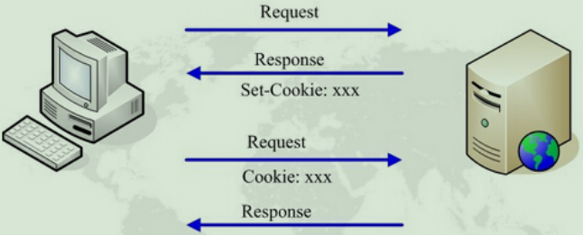
> Session的使用
- 使用Cookie来实现

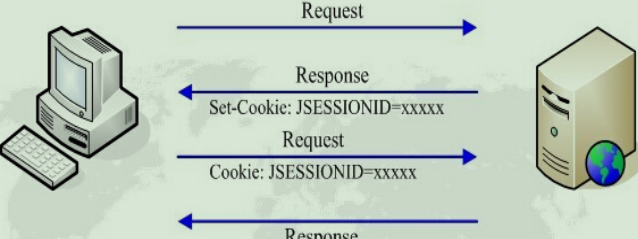

- 使用URL回显来实现

把sessionID放到URL上，以URL的token的形式存在（老式的诺基亚就是这么做的），过期时间很短，一般用在网银上，这样安全性会很高。


### HTTP的缓存机制

#### 为什么要进行缓存
最大可能的节省网络资源，因为缓存会根据请求保存输出内容的副本，例如html页面，图片，文件，当下一个请求来到的时候：如果是相同的URL，缓存直接使用副本响应访问请求，而不是向源服务器再次发送请求。

#### 缓存的优点

- 减少响应的延迟
- 减少网络带宽的消耗

#### 缓存规则解析
为了方便理解我们可以认为浏览器是存在一个缓存数据库的，用来存储缓存信息。

在客户端第一次请求数据时，此时缓存数据库中没有对应的缓存数据，需要请求服务器，服务器返回后，将数据存储至缓存数据库中。

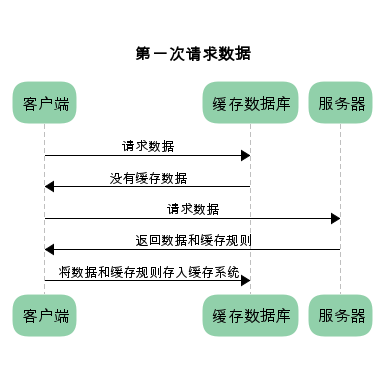

强制缓存与对比缓存

已存在缓存数据时，仅基于强制缓存，请求数据的流程如下

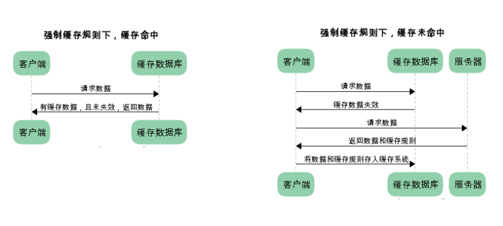

已存在缓存数据时，仅基于对比缓存，请求数据的流程如下

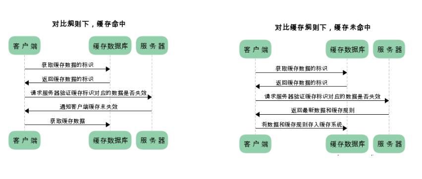

我们可以看到两类缓存规则的不同，强制缓存如果生效，不需要再和服务器发生交互，而对比缓存不管是否生效，都需要与服务端发生交互。 

两类缓存规则可以同时存在，强制缓存优先级高于对比缓存，也就是说，当执行强制缓存的规则时，如果缓存生效，直接使用缓存，不再执行对比缓存规则。

##### 强制缓存
强制缓存，服务器通知浏览器一个缓存时间，在缓存时内，下次请求，直接用缓存，不在时间内，执行比较缓存策略。

对于强制缓存来说，响应header中会有两个字段来标明失效规则（Expires/Cache-Control） 
使用chrome的开发者工具，可以很明显的看到对于强制缓存生效时，网络请求的情况

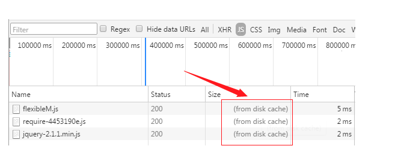

**Expires**

Expires的值为服务端返回的到期时间，即下一次请求时，请求时间小于服务端返回的到期时间，直接使用缓存数据。 
不过Expires 是HTTP 1.0的东西，现在默认浏览器均默认使用HTTP 1.1，所以它的作用基本忽略。 
另一个问题是，到期时间是由服务端生成的，但是客户端时间可能跟服务端时间有误差，这就会导致缓存命中的误差。 
所以HTTP 1.1 的版本，使用Cache-Control替代。

**Cache-Control**

Cache-Control 是最重要的规则。常见的取值有private、public、no-cache、max-age，no-store，默认为private。

- private: 客户端可以缓存
- public: 客户端和代理服务器都可缓存（前端的同学，可以认为public和private是一样的）
- max-age=xxx: 缓存的内容将在 xxx 秒后失效
- no-cache: 需要使用对比缓存来验证缓存数据（后面介绍）
- no-store: 所有内容都不会缓存，强制缓存，对比缓存都不会触发（对于前端开发来说，缓存越多越好，so…基本上和它说886）

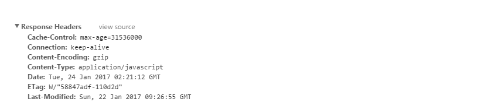

图中Cache-Control仅指定了max-age，所以默认为private，缓存时间为31536000秒（365天） 
也就是说，在365天内再次请求这条数据，都会直接获取缓存数据库中的数据，直接使用。

##### 比较缓存

- 比较缓存，顾名思义，需要进行比较判断是否可以使用缓存，也叫协商缓存，

浏览器第一次请求数据时，服务器会将缓存标识与数据一起返回给客户端，客户端将二者备份至缓存数据库中。 再次请求数据时，客户端将备份的缓存标识发送给服务器，服务器根据缓存标识进行判断，判断成功后，返回304状态码，通知客户端比较成功，可以使用缓存数据。

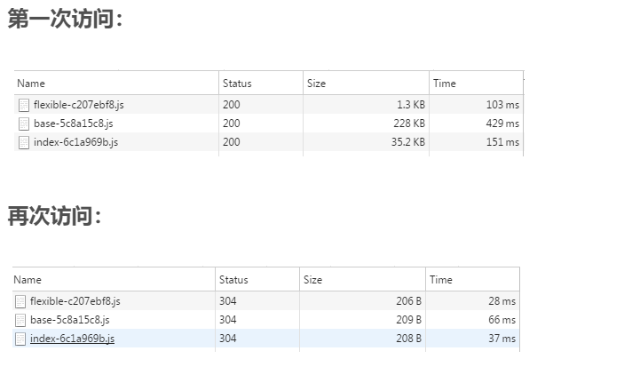

通过两图的对比，我们可以很清楚的发现，在对比缓存生效时，状态码为304，并且报文大小和请求时间大大减少。 
原因是，服务端在进行标识比较后，只返回header部分，通过状态码通知客户端使用缓存，不再需要将报文主体部分返回给客户端。

对于对比缓存来说，缓存标识的传递是我们着重需要理解的，它在请求header和响应header间进行传递， 
一共分为两种标识传递，接下来，我们分开介绍

> **Last-Modified/If-Modified-Since策略**

**Last-Modified：**服务器在响应请求时，告诉浏览器资源的最后修改时间。

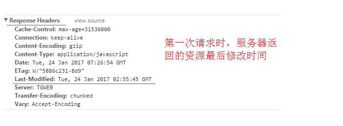

- 两类缓存规则可以同时存在，强制缓存优先级高于对比缓存，也就是说，当执行强制缓存的规则时，如果缓存生效，直接使用缓存，不再执行对比缓存规则。


**If-Modified-Since：**
再次请求服务器时，通过此字段通知服务器上次请求时，服务器返回的资源最后修改时间。 
服务器收到请求后发现有头If-Modified-Since 则与被请求资源的最后修改时间进行比对。 
若资源的最后修改时间大于If-Modified-Since，说明资源又被改动过，则响应整片资源内容，返回状态码200； 
若资源的最后修改时间小于或等于If-Modified-Since，说明资源无新修改，则响应HTTP 304，告知浏览器继续使用所保存的cache。

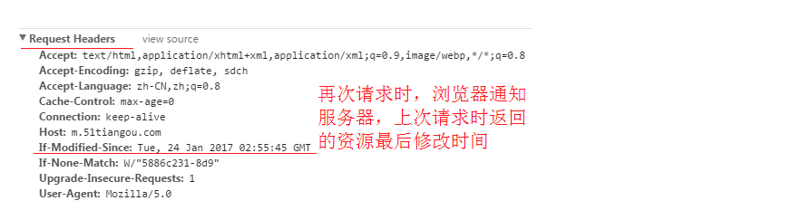

> **Etag/If-None-Match策略**

（优先级高于Last-Modified / If-Modified-Since）

**Etag：**
服务器响应请求时，告诉浏览器当前资源在服务器的唯一标识（生成规则由服务器决定）

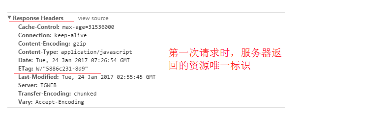

**If-None-Match:**

再次请求服务器时，通过此字段通知服务器客户段缓存数据的唯一标识。 
服务器收到请求后发现有头If-None-Match 则与被请求资源的唯一标识进行比对， 
不同，说明资源又被改动过，则响应整片资源内容，返回状态码200； 
相同，说明资源无新修改，则响应HTTP 304，告知浏览器继续使用所保存的cache

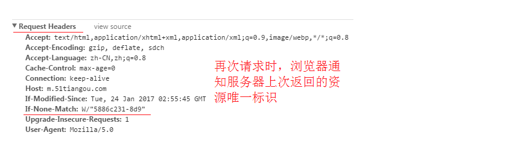

##### 总结
对于强制缓存，服务器通知浏览器一个缓存时间，在缓存时间内，下次请求，直接用缓存，不在时间内，执行比较缓存策略。 
对于比较缓存，将缓存信息中的Etag和Last-Modified通过请求发送给服务器，由服务器校验，返回304状态码时，浏览器直接使用缓存。

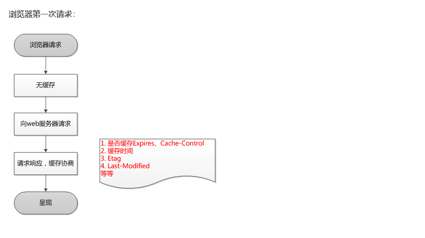

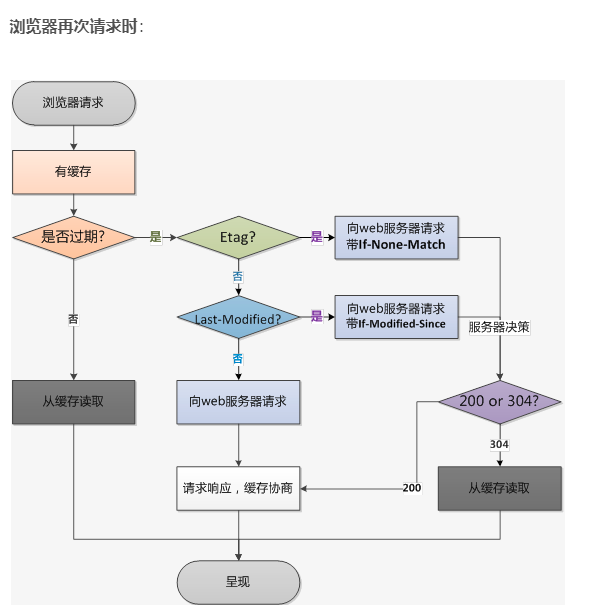

## HTTPS协议分析
一些概念
- HTTPS协议的安全性由SSL协议实现，当前使用的TLS协议1.2版本包含了四个核心子协议：握手协议、密钥配置切换协议、应用数据协议及报警协议。

- 数字证书：数字证书是互联网通信中标识双方身份信息的数字文件，由CA签发。

- CA：CA（certification authority）是数字证书的签发机构。作为权威机构，其审核申请者身份后签发数字证书，这样我们只需要校验数字证书即可确定对方的真实身份。

- HTTPS协议、SSL协议、TLS协议、握手协议的关系
    - HTTPS是Hypertext Transfer Protocol over Secure Socket Layer的缩写，即HTTP over SSL，可理解为基于SSL的HTTP协议。HTTPS协议安全是由SSL协议实现的。
    - SSL协议是一种记录协议，扩展性良好，可以很方便的添加子协议，而握手协议便是SSL协议的一个子协议。
    - TLS协议是SSL协议的后续版本，本文中涉及的SSL协议默认是TLS协议1.2版本。

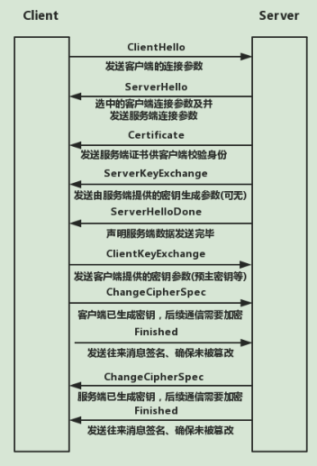


HTTP协议由于是明文传送，所以存在三大风险：

1、被窃听的风险：第三方可以截获并查看你的内容

2、被篡改的危险：第三方可以截获并修改你的内容

3、被冒充的风险：第三方可以伪装成通信方与你通信

所以HTTPS与HTTP比较有三大好处
- 数据完整性：内容传输经过完整性校验
- 数据隐私性：内容经过对称加密，每个连接生成一个唯一的加密密钥
- 身份认证：第三方无法伪造服务端（客户端）身份

> HTTPS通信过程
首先看看组成HTTPS的协议：HTTP协议和SSL/TLS协议。HTTP协议就不用讲了，而SSL/TLS就是负责加密解密等安全处理的模块，所以HTTPS的核心在SSL/TLS上面。整个通信如下：

- 1、浏览器发起往服务器的443端口发起请求，请求携带了浏览器支持的加密算法和哈希算法。

- 2、服务器收到请求，选择浏览器支持的加密算法和哈希算法。

- 3、服务器下将数字证书返回给浏览器，这里的数字证书可以是向某个可靠机构申请的，也可以是自制的。

- 4、浏览器进入数字证书认证环节，这一部分是浏览器内置的TLS完成的：

    - 4.1 首先浏览器会从内置的证书列表中索引，找到服务器下发证书对应的机构，如果没有找到，此时就会提示用户该证书是不是由权威机构颁发，是不可信任的。如果查到了对应的机构，**则取出该机构颁发的公钥**。

    - 4.2 用机构的证书公钥解密得到证书的内容和证书签名，内容包括网站的网址、网站的公钥、证书的有效期等。浏览器会先验证证书签名的合法性（验证过程类似上面Bob和Susan的通信）。签名通过后，浏览器验证证书记录的网址是否和当前网址是一致的，不一致会提示用户。如果网址一致会检查证书有效期，证书过期了也会提示用户。这些都通过认证时，浏览器就可以安全**使用**证书中的**网站公钥**了。

    - 4.3 浏览器生成一个随机数R，并**使用网站公钥对R进行加密**。

- 5、浏览器将加密的R传送给服务器。

- 6、服务器用自己的私钥解密得到R。

- 7、服务器以R为密钥使用了对称加密算法加密网页内容并传输给浏览器。

- 8、浏览器以R为密钥使用之前约定好的解密算法获取网页内容。

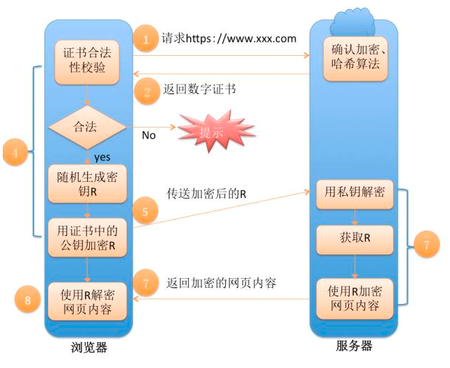

备注1：前5步其实就是HTTPS的握手过程，这个过程主要是认证服务端证书（内置的公钥）的合法性。因为非对称加密计算量较大，整个通信过程只会用到一次非对称加密算法（主要是用来保护传输客户端生成的用于对称加密的随机数私钥）。后续内容的加解密都是通过一开始约定好的对称加密算法进行的。

备注2：SSL/TLS是HTTPS安全性的核心模块，TLS的前身是SSL，TLS1.0就是SSL3.1，TLS1.1是SSL3.2，TLS1.2则是SSL3.3。 SSL/TLS是建立在TCP协议之上，因而也是应用层级别的协议。其包括TLS Record Protocol和TLS Handshaking Protocols两个模块，后者负责握手过程中的身份认证，前者则保证数据传输过程中的完整性和私密性。

[https部分摘抄于这里](https://blog.csdn.net/wangtaomtk/article/details/80917081)


## HTTP2协议分析

- HTTP2在使用的时候默认带加密链接，但不是HTTPS，
- 当使用HTTP2时浏览器会显示https://xxxx
- 会有一些奇怪的请求头出现

- 如果使用HTTP2请求的话，如果浏览器支持的话，浏览器会自动给你升级加HTTP2都有的头（伪头）；如果不支持的话，就要看服务器策略，不同意强制升级的话，浏览器会出现报错，如果同意的话，就可以用HTTP1.1

### HTTP/1.1 存在的问题:
> 1、TCP 连接数限制

对于同一个域名，浏览器最多只能同时创建 6~8 个 TCP 连接 (不同浏览器不一样)。为了解决数量限制，出现了 域名分片 技术，其实就是资源分域，将资源放在不同域名下 (比如二级子域名下)，这样就可以针对不同域名创建连接并请求，以一种讨巧的方式突破限制，但是滥用此技术也会造成很多问题，比如每个 TCP 连接本身需要经过 DNS 查询、三步握手、慢启动等，还占用额外的 CPU 和内存，对于服务器来说过多连接也容易造成网络拥挤、交通阻塞等，对于移动端来说问题更明显，可以参考这篇文章: Why Domain Sharding is Bad News for Mobile Performance and Users

在图中可以看到新建了六个 TCP 连接，每次新建连接 DNS 解析需要时间(几 ms 到几百 ms 不等)、TCP 慢启动也需要时间、TLS 握手又要时间，而且后续请求都要等待队列调度

> 2、线头阻塞 (Head Of Line Blocking) 问题

每个 TCP 连接同时只能处理一个请求 - 响应，浏览器按 FIFO 原则处理请求，如果上一个响应没返回，后续请求 - 响应都会受阻。为了解决此问题，出现了 管线化 - pipelining 技术，但是管线化存在诸多问题，比如第一个响应慢还是会阻塞后续响应、服务器为了按序返回相应需要缓存多个响应占用更多资源、浏览器中途断连重试服务器可能得重新处理多个请求、还有必须客户端 - 代理 - 服务器都支持管线化

> 3、Header 内容多，而且每次请求 Header 不会变化太多，没有相应的压缩传输优化方案

> 4、为了尽可能减少请求数，需要做合并文件、雪碧图、资源内联等优化工作，但是这无疑造成了单个请求内容变大延迟变高的问题，且内嵌的资源不能有效地使用缓存机制

> 5、明文传输不安全

### HTTP2 的优势:

- 1.使用二进制格式传输，更高效、更紧凑。

    - 在HTTP1.x中用文本形式传输数据（ASCII）

    - 在HTTP2中使用二进制格式传输


- 对报头压缩，降低开销。

    - 这个特性是HTTP2天然支持的不需要设置，
    - HTTTP1.x中对报文主体进行压缩（其实主要是cookie）
    - HTTP2对请求体和请求头都进行压缩

- 多路复用，一个网络连接实现并行请求。
    - HTTP/1.x 有个问题叫线端阻塞(head-of-line blocking), 它是指一个连接(connection)一次只提交一个请求的效率比较高, 多了就会变慢
    - HTTP1.x用多个链路去做并发传输（多任务），一般是链式的一个链路完成在进行下一个
    - HTTP2以切块的形式，用同一个链路复用去做并行传输
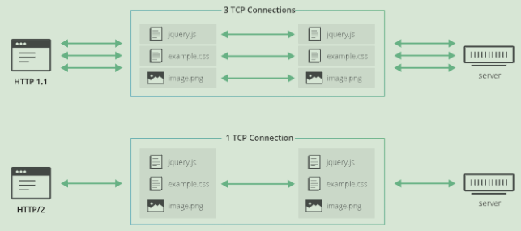


- 服务器主动推送，减少请求的延迟

当浏览器请求一个网页时，服务器将会发回HTML，在服务器开始发送JavaScript、图片和CSS前，服务器需要等待浏览器解析HTML和发送所有内嵌资源的请求。服务器推送服务通过“推送”那些它认为客户端将会需要的内容到客户端的缓存中，以此来避免往返的延迟。

- 默认使用加密

默认展现的形式是HTTPS

### HTTP2的伪头字段

伪头部字段是http2内置的几个特殊的以”:”开始的
key，用于替代HTTP/1.x中请求行/响应行中的信
息，比如请求方法，响应状态码等
- :method 目标URL模式部分（请求）
- :scheme 目标URL模式部分（请求）
- :authority 目标RUL认证部分（请求）
- :path 目标URL的路径和查询部分（绝对路径
产生式和一个跟着"？"字符的查询产生式）。
（请求）
- :status 响应头中的HTTP状态码部分（响应）

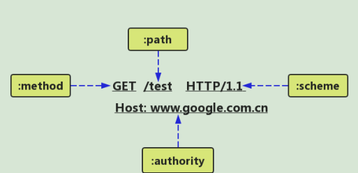


## 了解HTTP 3

- 强行被叫做HTTP3，原名叫HTTP-over-QUIC，底层协议从TCP换成了UDP协议）
- QUIC协议是什么（Quick UDP Internet
Connection）
- HTTP 3与HTTP 1.1和HTTP 2没有直接
的关系
- HTTP 3不是http2的扩展
- HTTP 3将会是一个全新的WEB协议
- HTTP 3目前处于制订和测试阶段

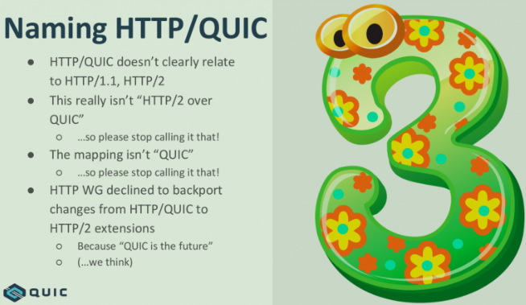

## HTTP与反向代理
- 什么是代理?
- 什么是反向代理?
- 为什么要使用代理服务器?
- 正向代理和反向代理的区别
- 都有哪些反向代理服务器? 
- 反向代理的用途

### 什么是代理?
我们平时说的代理就是指正向代理。

在NAT技术(Network Address Translation)出现之前，所有主机无法直接与外网相连，要想上网，需要连接到一台能够访问外网的Web服务器，再通过这台服务器访问外网。而这台Web服务器就叫做“正向代理服务器”。

现在的“FQ”技术也是如何，我们把请求发给一台可以连接外面世界的Web服务器，由它转发我们的请求，再将结果返回给我们。这台Web服务器就是“正向代理服务器”。

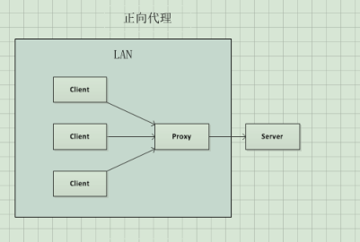

简单一点：A向C借钱，由于一些情况不能直接向C借钱，于是A想了一个办法，他让B去向C借钱，这样B就代替A向C借钱，A就得到了C的钱，C并不知道A的存在，B就充当了A的代理人的角色。 

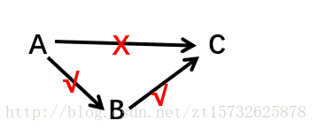

综上所述：正向代理服务器是客户端和目的服务器之间的一个中介，客户端通过正向代理服务器访问客户端原本无法访问的目标服务器。

### 为什么要使用代理服务器
- 提高访问速度 

由于目标主机返回的数据会存放在代理服务器的硬盘中，因此下一次客户再访问相同的站点数据时，会直接从代理服务器的硬盘中读取，起到了缓存的作用，尤其对于热门网站能明显提高访问速度。

- 防火墙作用 

由于所有的客户机请求都必须通过代理服务器访问远程站点，因此可以在代理服务器上设限，过滤掉某些不安全信息。同时正向代理中上网者可以隐藏自己的IP,免受攻击。

- 突破访问限制 

互联网上有许多开发的代理服务器，客户机在访问受限时，可通过不受限的代理服务器访问目标站点，通俗说，我们使用的翻墙浏览器就是利用了代理服务器，可以直接访问外网。

### 反向代理

　客户端向一个服务器A提交请求后，服务器A偷偷地去服务器B上获取资源，并返回给客户端。客户端天真地以为数据是服务器A给他的。在这过程中，服务器A称为“反向代理服务器”，服务器B称为反向代理服务器的“后端服务器”（代理服务器内部网络上的服务器）。

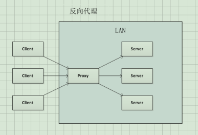

理解起来有些抽象，可以这么说：A向B借钱，B没有拿自己的钱，而是悄悄地向C借钱，拿到钱之后再交给A,A以为是B的钱，他并不知道C的存在。 

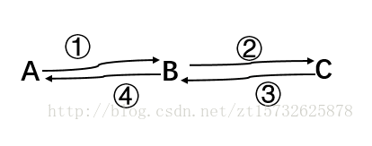


### 正向代理和反向代理的区别

> 位置不同 
- 正向代理，架设在客户机和目标主机之间； 
- 反向代理，架设在服务器端；
>代理对象不同 
- 正向代理，代理客户端，服务端不知道实际发起请求的客户端； 
- 反向代理，代理服务端，客户端不知道实际提供服务的服务端；

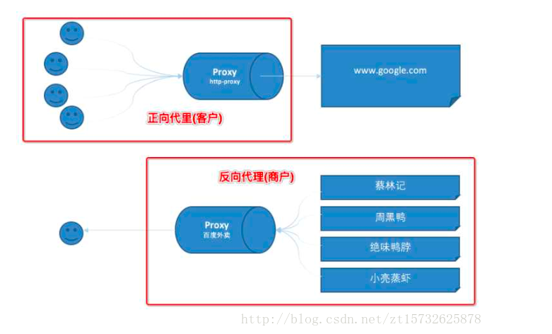

> 安全性不同 
- 正向代理允许客户端通过它访问任意网站并且隐藏客户端自身，因此必须采取安全措施以确保仅为授权的客户端提供服务； 
- 反向代理都对外都是透明的，访问者并不知道自己访问的是哪一个代理。

> 用途不同 
- 正向代理，为在防火墙内的局域网客户端提供访问Internet的途径；

- 反向代理，将防火墙后面的服务器提供给Internet访问；

### 正向代理的应用

- 1.访问原来无法访问的资源 
- 2.用作缓存，加速访问速度 
- 3.对客户端访问授权，上网进行认证 
- 4.代理可以记录用户访问记录（上网行为管理），对外隐藏用户信息

### 反向代理的用途

- 加密和SSL加速

  使用SSL配置代理服务器可以做到加密和SLL加速，因为数据消耗服务器资源的操作都会让反向代理服务器计算，而web服务器只做一些IO操作

- 负载均衡

将服务器接收到的请求按照规则分发的过程，称为`负载均衡`。客户端发送的、nginx反向代理服务器接收到的请求数量，就是我们说的`负载量`;请求数量按照一定的规则进行分发到不同的服务器处理的规则，就是一种`均衡规则`

`负载均衡`在实际项目操作过程中，有硬件负载均衡和软件负载均衡两种，硬件负载均衡也称为硬负载，如F5负载均衡，相对造价昂贵成本较高，但是数据的稳定性安全性等等有非常好的保障，如中国移动中国联通这样的公司才会选择硬负载进行操作；更多的公司考虑到成本原因，会选择使用软件负载均衡，软件负载均衡是利用现有的技术结合主机硬件实现的一种消息队列分发机制

例子如：12306网站容易奔溃（做集群，代理服务器根据集群中所有服务器的负载量与负载规则对请求进行分发，所以处理高并发so easy，注意不能用用，因为要保持数据一致性）

<!-- 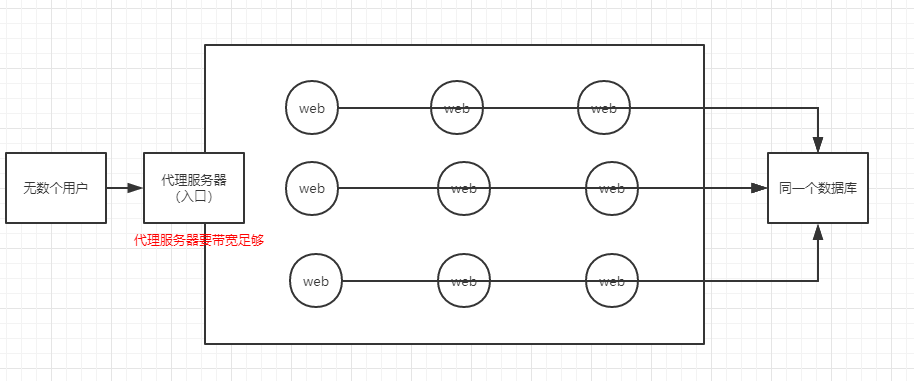 -->
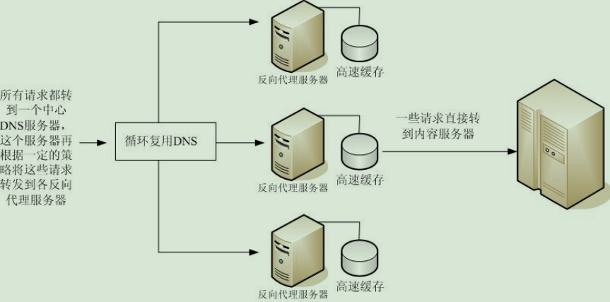

- 缓存静态内容

把静态资源放到内存里，减少IO压力。

- 压缩： 把资源进行压缩，同样减少IO压力。

- 减速上传

向百度云盘的上传，花钱买带宽，一般是从协议层做。

- 安全：攻击时先需要破解代理服务器

- 外网发布：对外统一经过80端口发布

### 都有哪些反向代理服务器

Nginx等


## Nginx

[详情见文档](./nginx配置学习资料.pdf)