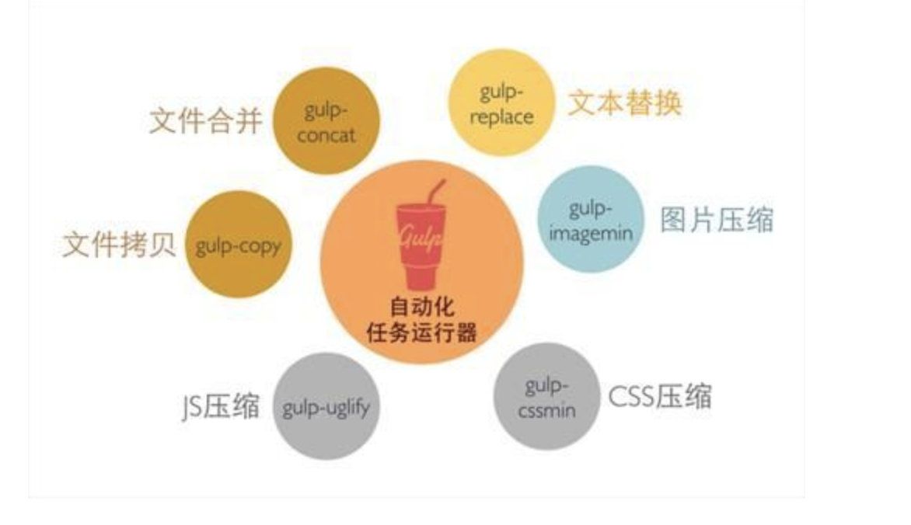

# gulp简介

官网介绍gulp是一个流构建系统（The streaming build system）

gulp是前端开发过程中对代码进行构建的工具，是自动化项目的构建利器；她不仅能对网站资源进行优化，而且在开发过程中很多重复的任务能够使用正确的工具自动完成；使用它，我们不仅可以很愉快的编写代码，而且大大提高我们的工作效率。

gulp是基于Nodejs的自动任务运行器， 她能自动化地完成 javascript/coffee/sass/less/html/image/css 等文件的的测试、检查、合并、压缩、格式化、浏览器自动刷新、部署文件生成，并监听文件在改动后重复指定的这些步骤。在实现上，她借鉴了Unix操作系统的管道（pipe）思想，前一级的输出，直接变成后一级的输入，使得在操作上非常简单。

gulp 和 grunt 非常类似，但相比于 grunt 的频繁 IO 操作，gulp 的流操作，能更快地更便捷地完成构建工作。

gulp常用地址：

gulp官方网址：http://gulpjs.com

gulp插件地址：http://gulpjs.com/plugins

gulp 官方API：https://github.com/gulpjs/gulp/tree/master/docs/api

gulp 中文API：http://www.ydcss.com/archives/424

## 安装

步骤一：以全局方式安装gulp,执行gulp任务
```
npm install -g gulp
```
步骤二：把gulp安装在本地,调用插件的功能
```
npm install --save-dev gulp
```
## 作用

- Sass/less编译
- Css Js 图片压缩
- Css Js 合并
- Css Js 内联
- Html的include功能
- Autoprefixer
- 自动刷新
- 去缓存
- Handlebars模板文件的预编译
- 雪碧图
- ESLint rem移动端适配方案

gulp有很多插件可以做到你想做的事情,插件[地址](http://gulpjs.com/plugins)

## 应用
安装了gulp以后你需要在你的文件夹里边创建一个gulpfile.js文件，它是gulp的配置文件。在这里边你可以创建你要创建的任务，以及应用各种插件，相当于webpack的webpack.config.js

大概就是这样的一份文件
```
//导入工具包 require('node_modules里对应模块')
var gulp = require('gulp'), //本地安装gulp所用到的地方
    concat = require('gulp-concat'),//合并文件 --合并只是放一起--压缩才会真正合并相同样式
    less = require('gulp-less'),//编译less文件
    cssmin = require('gulp-minify-css'),//压缩css文件
    rename = require('gulp-rename'),//设置压缩后的文件名
    autoprefixer = require('gulp-autoprefixer'),//给 CSS 增加前缀。解决某些CSS属性不是标准属性，有各种浏览器前缀的情况
    imagemin = require('gulp-imagemin'),  //图片压缩
    spriter=require('gulp-css-spriter');//合并图片

//编译less文件   定义一个testLess任务（自定义任务名称）
gulp.task('testLess', function () {
    gulp.src('src/less/index.less') //该任务针对的文件
        .pipe(less()) //该任务调用的模块
        .pipe(gulp.dest('src/css')); //将会在src/css下生成index.css
});

//压缩css文件
gulp.task('minifycss', function() {
    gulp.src('src/css/index.css')      //压缩的文件
        .pipe(cssmin())   //执行压缩
        .pipe(gulp.dest('src/cssmin'))   //输出文件夹
});

gulp.task('default',['testLess','minifycss'],function(){//定义默认任务  先执行testLess和minifycss 再执行console.log('hello world');
    console.log('hello world');
}); 

//gulp.task(name[, deps], fn) 定义任务  name：任务名称 deps：依赖任务名称 fn：回调函数
//gulp.src(globs[, options]) 执行任务处理的文件  globs：处理的文件路径(字符串或者字符串数组) 
//gulp.dest(path[, options]) 处理完后文件生成路径
```

## [API](https://github.com/gulpjs/gulp/tree/master/docs/api)

### src
src用于创建一个流用于读取文件系统里的文件对象

> 语法
```
src(globs, [options])
```
`globs`：是用来监控或者找到文件
`options`:是你要对你监控文件做的一些事情具
### dest

dest 用于创建一个将文件对象写入文件系统的流，他是一个可以在管道的中间或末尾使用的流
> 语法
```
dest(directory, [options])
```
`directory`:将写入文件的输出目录的路径。如果使用函数，将使用每个Vinyl对象调用该函数，并且必须返回字符串目录路径。

`options`:是你要对你写入文件要做的事情

### symlink

symlink 创建用于将Vinyl对象链接到文件系统的流。就是一个符号链接，即其实就是linux里的软连接，就是副本，但是当删除源文件时，软连接文件也会被删除。

> 语法
```
symlink(directory, [options])
```
`directory`:输出目录的路径，其中将创建符号链接。如果使用函数，将使用每个Vinyl对象调用该函数，并且必须返回字符串目录路径。
`options`:是你要对你输出目录设置的选项。

### lastRun

检索在当前运行过程中上次成功完成任务的时间。在观察程序运行时，对后续任务运行最有用。

与之结合使用时src()，通过跳过自上次成功完成任务以来未发生更改的文件，启用增量构建以加快执行时间。

用法：
```
const { src, dest, lastRun, watch } = require('gulp');
const imagemin = require('gulp-imagemin');

function images() {
  return src('src/images/**/*.jpg', { since: lastRun(images) })
    .pipe(imagemin())
    .pipe(dest('build/img/'));
}

function watch() {
  watch('src/images/**/*.jpg', images);
}

exports.watch = watch;
```

>语法
```
lastRun(task, [precision])
```

`task`:任务函数或已注册任务的字符串别名。

`precision`:时间戳精度，默认值：1000

### series

将任务函数和/或组合操作组合成更大的操作，这些操作将`按顺序依次执行`。使用series()和组合操作的嵌套深度没有强制限制parallel()。

> 语法
```
series(...tasks)
```
`...task`:任意数量的任务函数都可以作为单独的参数传递。如果您之前已注册任务，则可以使用字符串，但不建议这样做。

> 用法：
```
const { series } = require('gulp');

function javascript(cb) {
  // body omitted
  cb();//相当于回调：官网是这么介绍的应该由一些异步工作调用
}

function css(cb) {
  // body omitted
  cb();
}

exports.build = series(javascript, css);
```
### parallel

将任务函数和/或组合操作组合成将`同时执行`的更大操作。使用series()和组合操作的嵌套深度没有强制限制parallel()

> 语法
```
parallel(...tasks)
```
`...task`:任意数量的任务函数都可以作为单独的参数传递。如果您之前已注册任务，则可以使用字符串，但不建议这样做。

### watch

允许在发生更改时观看全局并运行任务。任务与任务系统的其余部分统一处理。

> 语法：
```
watch(globs, [options], [task])
```
> 参数

`globs`:需要被监控的文件

`options`:控制监控的选项
`task`:需要被监控的任务

>用法
```
const { watch } = require('gulp');

const watcher = watch(['input/*.js']);

watcher.on('change', function(path, stats) {
  console.log(`File ${path} was changed`);
});

watcher.on('add', function(path, stats) {
  console.log(`File ${path} was added`);
});

watcher.on('unlink', function(path, stats) {
  console.log(`File ${path} was removed`);
});

watcher.close();//关闭监控
```
### task

定义任务系统中的任务。任务然后可以通过命令行和访问series()，parallel()以及lastRun()API的。
> 语法
```
task([taskName], taskFunction)
```
参数

`taskName`：任务名称

`taskFunction`: 一个任务功能或组成的工作-通过产生series()和parallel()。理想情况下是命名函数。可以附加任务元数据以向命令行提供额外信息。
> 用法：

将命名函数注册为任务：

```
const { task } = require('gulp');

function build(cb) {
  // body omitted
  cb();
}

task(build);
```
将匿名函数注册为任务：
```
const { task } = require('gulp');

task('build', function(cb) {
  // body omitted
  cb();
});
```

检索先前已注册的任务：
```
const { task } = require('gulp');

task('build', function(cb) {
  // body omitted
  cb();
});

const build = task('build');`
```

### registry
允许将自定义注册表插入任务系统，该任务系统可以提供共享任务或增强功能。

未测试（后续更新）

### tree
获取当前任务依赖关系树 - 在极少数情况下需要它。

通常，tree()gulp使用者不会使用它，但它是暴露的，因此CLI可以显示gulpfile中定义的任务的依赖关系图

### Vinyl

虚拟文件格式。读取文件时src()，会生成Vinyl对象来表示文件 - 包括路径，内容和其他元数据。

Vinyl对象可以使用插件进行转换。它们也可以使用持久化到文件系统dest()。

创建自己的Vinyl对象时src()- 使用外部vinyl模块而不是生成- 如下面的用法所示。

> 用法

```
const Vinyl = require('vinyl');

const file = new Vinyl({
  cwd: '/',
  base: '/test/',
  path: '/test/file.js',
  contents: new Buffer('var x = 123')
});

file.relative === 'file.js';

file.dirname === '/test';
file.dirname = '/specs';
file.path === '/specs/file.js';

file.basename === 'file.js';
file.basename = 'file.txt';
file.path === '/specs/file.txt';

file.stem === 'file';
file.stem = 'foo';
file.path === '/specs/foo.txt';
file.extname === '.txt';
file.extname = '.js';
file.path === '/specs/file.js';
```

## 一些常用的插件

官网的插件太多了，下面就是介绍一些常用的插件，[官网插件地址](http://gulpjs.com/plugins)


### 匹配符 *、**、！、{}
```
gulp.src('./js/*.js')               // * 匹配js文件夹下所有.js格式的文件
gulp.src('./js/**/*.js')            // ** 匹配js文件夹的0个或多个子文件夹
gulp.src(['./js/*.js','!./js/index.js'])    // ! 匹配除了index.js之外的所有js文件
gulp.src('./js/**/{omui,common}.js')        // {} 匹配{}里的文件名
```
### 文件操作

#### del (替代gulp-clean)
```
var del = require('del');

del('./dist');                      // 删除整个dist文件夹
```

#### gulp-rename
**描述**：重命名文件。
```
var rename = require("gulp-rename");

gulp.src('./hello.txt')
  .pipe(rename('gb/goodbye.md'))    // 直接修改文件名和路径
  .pipe(gulp.dest('./dist')); 
 
gulp.src('./hello.txt')
  .pipe(rename({
    dirname: "text",                // 路径名
    basename: "goodbye",            // 主文件名
    prefix: "pre-",                 // 前缀
    suffix: "-min",                 // 后缀
    extname: ".html"                // 扩展名
  }))
  .pipe(gulp.dest('./dist'));
```
#### gulp-concat
**描述**：合并文件。
```
var concat = require('gulp-concat');

gulp.src('./js/*.js')
    .pipe(concat('all.js'))         // 合并all.js文件
    .pipe(gulp.dest('./dist'));
    
gulp.src(['./js/demo1.js','./js/demo2.js','./js/demo2.js'])
    .pipe(concat('all.js'))         // 按照[]里的顺序合并文件
    .pipe(gulp.dest('./dist'));
```
#### gulp-filter
**描述**：在虚拟文件流中过滤文件。
```
var filter = require('gulp-filter');

const f = filter(['**', '!*/index.js']);
gulp.src('js/**/*.js')
    .pipe(f)                        // 过滤掉index.js这个文件
    .pipe(gulp.dest('dist'));

const f1 = filter(['**', '!*/index.js'], {restore: true});
gulp.src('js/**/*.js')
    .pipe(f1)                       // 过滤掉index.js这个文件
    .pipe(uglify())                 // 对其他文件进行压缩
    .pipe(f1.restore)               // 返回到未过滤执行的所有文件
    .pipe(gulp.dest('dist'));       // 再对所有文件操作，包括index.js
```
### 压缩
#### gulp-uglify
**描述**：压缩js文件大小。
```
var uglify = require("gulp-uglify");

gulp.src('./hello.js')
    .pipe(uglify())                 // 直接压缩hello.js
    .pipe(gulp.dest('./dist'))
    
 gulp.src('./hello.js')
    .pipe(uglify({
        mangle: true,               // 是否修改变量名，默认为 true
        compress: true,             // 是否完全压缩，默认为 true
        preserveComments: 'all'     // 保留所有注释
    }))
    .pipe(gulp.dest('./dist'))
```

#### gulp-csso | gulp-minify-css
**描述**：压缩优化css。

var csso = require('gulp-csso');

gulp.src('./css/*.css')
    .pipe(csso())
    .pipe(gulp.dest('./dist/css'))

#### gulp-html-minify
**描述**：压缩HTML。
```
var htmlminify = require('gulp-html-minify');

gulp.src('index.html')
    .pipe(htmlminify())
    .pipe(gulp.dest('./dist'))
```
#### gulp-imagemin
**描述**：压缩图片。
```
var imagemin = require('gulp-imagemin');

gulp.src('./img/*.{jpg,png,gif,ico}')
    .pipe(imagemin())
    .pipe(gulp.dest('./dist/img'))
```
#### gulp-zip
**描述**：ZIP压缩文件。
```
var zip = require('gulp-zip');

gulp.src('./src/*')
    .pipe(zip('all.zip'))                   // 压缩成all.zip文件
    .pipe(gulp.dest('./dist'))
```

#### JS/CSS自动注入

#### gulp-autoprefixer
**描述**：自动为css添加浏览器前缀。
```
var autoprefixer = require('gulp-autoprefixer');

gulp.src('./css/*.css')
    .pipe(autoprefixer())           // 直接添加前缀
    .pipe(gulp.dest('dist'))

gulp.src('./css/*.css')
    .pipe(autoprefixer({
        browsers: ['last 2 versions'],      // 浏览器版本
        cascade：true                       // 美化属性，默认true
        add: true                           // 是否添加前缀，默认true
        remove: true                        // 删除过时前缀，默认true
        flexbox: true                       // 为flexbox属性添加前缀，默认true
    }))
    .pipe(gulp.dest('./dist'))
```
查看更多配置：[options](https://github.com/postcss/autoprefixer#options)

更多浏览器版本：[browsers](https://github.com/ai/browserslist#queries)

#### gulp-useref
**描述**：解析构建块在HTML文件来代替引用未经优化的脚本和样式表。
```
// index.html

<!-- build:css /css/all.css -->
<link rel="stylesheet" href="css/normalize.css">
<link rel="stylesheet" href="css/main.css">
<!-- endbuild -->

// gulpfile.js

var useref = require('gulp-useref');

gulp.src('index.html')
    .pipe(useref())
    .pipe(gulp.dest('./dist'))
```
替换之后的index.html中就会变成：
```
<link rel="stylesheet" href="css/all.css">  // 之前的两个<link>替换成一个了
 ```
#### gulp-rev
**描述**：给静态资源文件名添加hash值:unicorn.css => unicorn-d41d8cd98f.css
```
var rev = require('gulp-rev');

gulp.src('./css/*.css')
    .pipe(rev())
    .pipe(gulp.dest('./dist/css'))
```   
#### gulp-rev-replace
**描述**：重写被gulp-rev重命名的文件名。
```
var rev = require('gulp-rev');
var revReplace = require('gulp-rev-replace');
var useref = require('gulp-useref');

gulp.src('index.html')
    .pipe(useref())                         // 替换HTML中引用的css和js
    .pipe(rev())                            // 给css,js,html加上hash版本号
    .pipe(revReplace())                     // 把引用的css和js替换成有版本号的名字
    .pipe(gulp.dest('./dist'))
```    
#### gulp-html-replace
**描述**：替换html中的构建块。
```
// index.html

<!-- build:css -->                          // css是buildName,可以自己定义
<link rel="stylesheet" href="css/normalize.css">
<link rel="stylesheet" href="css/main.css">
<!-- endbuild -->

// gulpfile.js

var htmlreplace = require('gulp-html-replace');

gulp.src('index.html')
    .pipe(htmlreplace({
        'css':'all.css'                     // css是index.html中定义的buildName
    }))
    .pipe(gulp.dest('./dist'))
```
替换之后的index.html中就会变成：
```
<link rel="stylesheet" href="all.css">      // 之前的两个<link>替换成一个了
```
### 流控制
#### gulp-if
**描述**：有条件地运行一个任务。
```
var gulpif = require('gulp-if');
var uglify = require('gulp-uglify');
var concat = require('gulp-concat');
var condition = true; 

gulp.src('./js/*.js')
    .pipe(gulpif(condition, uglify(), concat('all.js')))  // condition为true时执行uglify(), else 执行concat('all.js')
    .pipe(gulp.dest('./dist/'));
```  
### 工具
#### gulp-load-plugins
**描述**：从包的依赖和附件里加载gulp插件到一个对象里给你选择。
```
// package.json 

"devDependencies": {
    "gulp": "^3.9.1",
    "gulp-concat": "^2.6.1",
    "gulp-rename": "^1.2.2",
    "gulp-uglify": "^2.0.1"
}

// gulpfile.js

var $ = require('gulp-load-plugins')();     // $ 是一个对象,加载了依赖里的插件

gulp.src('./**/*.js')
    .pipe($.concat('all.js'))               // 使用插件就可以用$.PluginsName()
    .pipe($.uglify())
    .pipe($.rename('all.min.js'))
    .pipe(gulp.dest('./dist'))
```

#### gulp-sass

```
var sass = require('gulp-sass');

gulp.src('./sass/**/*.scss')
    .pipe(sass({
        outputStyle: 'compressed'           // 配置输出方式,默认为nested
    }))
    .pipe(gulp.dest('./dist/css'));
    
gulp.watch('./sass/**/*.scss', ['sass']);   // 实时监听sass文件变动,执行sass任务
```
#### gulp-less
**描述** :编译Less
```
var gulp = require('gulp'),
    less = require("gulp-less");
 
gulp.task('compile-less', function () {
    gulp.src('less/*.less')
    .pipe(less())
    .pipe(gulp.dest('dist/css'));
});
```

#### gulp-babel
**描述**：将ES6代码编译成ES5。
```
var babel = require('gulp-babel');

gulp.src('./js/index.js')
    .pipe(babel({
        presets: ['es2015']
    }))
    .pipe(gulp.dest('./dist'))
```

#### gulp-jshint    JS代码检查
```
var gulp = require('gulp');
var jshint = require("gulp-jshint");
 
gulp.task('jsLint', function () {
    gulp.src('js/*.js')
    .pipe(jshint())
    .pipe(jshint.reporter()); // 输出检查结果
});
```
#### gulp-livereload 自动刷新

**描述**：当代码变化时，它可以帮助我们自动刷新页面，该插件最好配合谷歌浏览器，且要安装livereload chrome extension扩展插件，否则无效。

```
var gulp = require('gulp'),
    less = require('gulp-less'),
    livereload = require('gulp-livereload');
 
gulp.task('less', function() {
  gulp.src('less/*.less')
    .pipe(less())
    .pipe(gulp.dest('css'))
    .pipe(livereload());
});
 
gulp.task('watch', function() {
  livereload.listen(); //要在这里调用listen()方法
  gulp.watch('less/*.less', ['less']);  //监听目录下的文件，若文件发生变化，则调用less任务。
});
```